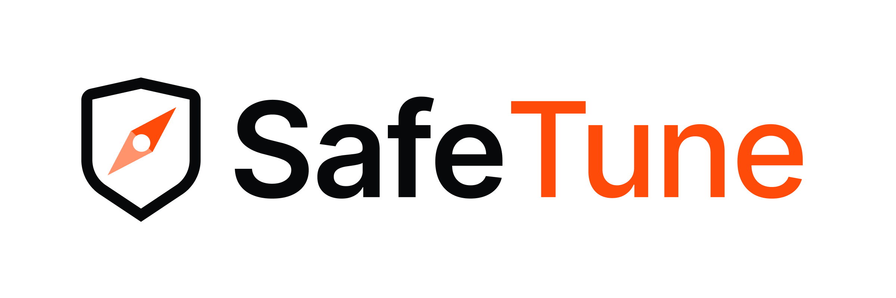

<p align="center">
  <picture>
    <source media="(prefers-color-scheme: dark)" srcset="docs/assets/safetune-logo-white.png">
    
  </picture>
</p>

<h3 align="center">A library of LLM-safety methods. Pick the one that fits your task — and know exactly what it implements.</h3>

<p align="center">
  <a href="https://github.com/Lexsi-Labs/SafeTune/blob/main/CHANGELOG.md"></a>
  <a href="https://www.python.org/downloads/"></a>
  <a href="LICENSE.md"></a>
</p>

<br>

SafeTune collects the many published methods for changing or measuring a
model's safety and puts them behind one consistent API. It is a **library, not a
pipeline**: each safety task has several methods that solve it by different
mechanisms, and you pick the one that fits — you don't chain them together.

## Install

```bash
pip install safetune            # from PyPI
# or, from source:
git clone https://github.com/Lexsi-Labs/SafeTune.git
cd SafeTune && pip install -e .
```

Requires Python ≥ 3.12 and PyTorch. The core library imports cleanly on CPU;
heavier extras (vLLM, Unsloth) install only when you ask for them.

## Run one in 60 seconds

```bash
# from a source checkout
python examples/quickstart/quickstart.py
# after `pip install safetune` (the wheel does not ship examples/): fetch the script
curl -LO https://raw.githubusercontent.com/Lexsi-Labs/SafeTune/main/examples/quickstart/quickstart.py
python quickstart.py
```

This runs the inference-time **Steer** path end to end on a small open model:
it extracts a refusal direction from contrast prompts, ablates it live, and
prints how refusal behaviour changes — no training, no checkpoints.

## Examples and notebooks

Every intervention class also has a runnable script under
[`examples/`](https://github.com/Lexsi-Labs/SafeTune/blob/main/examples/) — same code, terminal output instead of a browser;
see [Python Scripts](docs/examples/scripts.md) for the full list. The table
below is the notebook side: all 10 ship in
[`examples/notebooks/`](https://github.com/Lexsi-Labs/SafeTune/blob/main/examples/notebooks/), each opens straight into a free
Colab runtime (no local install), and all default to
`Qwen/Qwen2.5-0.5B-Instruct`.

- **01–06 · Demos** — one per pillar, runs to completion with printed output.
  Start with `steer_demo`.
- **07–08 · Comparisons** — several methods run side by side on the same
  checkpoint, so you can see the trade-off directly.
- **09–10 · Advanced** — a live monitoring demo and the full six-pillar
  pipeline chained end to end.

| # | Notebook | Pillar | What it shows | GPU | Open |
|---|---|---|---|---|---|
| <sub>01</sub> | <sub>[`steer_demo`](https://github.com/Lexsi-Labs/SafeTune/blob/main/examples/notebooks/steer_demo.ipynb)</sub> | <sub>Steer</sub> | <sub>extract a refusal direction and ablate it live — no training</sub> | <sub>No GPU</sub> | [](https://colab.research.google.com/github/Lexsi-Labs/SafeTune/blob/main/examples/notebooks/steer_demo.ipynb) |
| <sub>02</sub> | <sub>[`recover_demo`](https://github.com/Lexsi-Labs/SafeTune/blob/main/examples/notebooks/recover_demo.ipynb)</sub> | <sub>Recover</sub> | <sub>`ReStaTrainer` repairs a model fine-tuned on harmful data; the repair itself needs no training</sub> | <sub>No GPU</sub> | [](https://colab.research.google.com/github/Lexsi-Labs/SafeTune/blob/main/examples/notebooks/recover_demo.ipynb) |
| <sub>03</sub> | <sub>[`harden_demo`](https://github.com/Lexsi-Labs/SafeTune/blob/main/examples/notebooks/harden_demo.ipynb)</sub> | <sub>Harden</sub> | <sub>same contaminated fine-tune with no defense and with `SafeGradTrainer`</sub> | <sub>GPU helps</sub> | [](https://colab.research.google.com/github/Lexsi-Labs/SafeTune/blob/main/examples/notebooks/harden_demo.ipynb) |
| <sub>04</sub> | <sub>[`unlearn_demo`](https://github.com/Lexsi-Labs/SafeTune/blob/main/examples/notebooks/unlearn_demo.ipynb)</sub> | <sub>Unlearn</sub> | <sub>`GradientAscentTrainer` removes a capability via forget/retain sets</sub> | <sub>GPU helps</sub> | [](https://colab.research.google.com/github/Lexsi-Labs/SafeTune/blob/main/examples/notebooks/unlearn_demo.ipynb) |
| <sub>05</sub> | <sub>[`interpret_demo`](https://github.com/Lexsi-Labs/SafeTune/blob/main/examples/notebooks/interpret_demo.ipynb)</sub> | <sub>Interpret</sub> | <sub>locate safety circuits and neurons from contrast prompts</sub> | <sub>No GPU</sub> | [](https://colab.research.google.com/github/Lexsi-Labs/SafeTune/blob/main/examples/notebooks/interpret_demo.ipynb) |
| <sub>06</sub> | <sub>[`evaluate_demo`](https://github.com/Lexsi-Labs/SafeTune/blob/main/examples/notebooks/evaluate_demo.ipynb)</sub> | <sub>Evaluate</sub> | <sub>refusal checks on HarmBench and your own prompts, red-team attacks, entropy monitor; `evaluate()` needs a GPU</sub> | <sub>GPU helps</sub> | [](https://colab.research.google.com/github/Lexsi-Labs/SafeTune/blob/main/examples/notebooks/evaluate_demo.ipynb) |
| <sub>07</sub> | <sub>[`steer_comparison`](https://github.com/Lexsi-Labs/SafeTune/blob/main/examples/notebooks/steer_comparison.ipynb)</sub> | <sub>Steer</sub> | <sub>CAA vs RefusalDirection vs CAST vs AdaSteer, same checkpoint</sub> | <sub>GPU helps</sub> | [](https://colab.research.google.com/github/Lexsi-Labs/SafeTune/blob/main/examples/notebooks/steer_comparison.ipynb) |
| <sub>08</sub> | <sub>[`recover_comparison`](https://github.com/Lexsi-Labs/SafeTune/blob/main/examples/notebooks/recover_comparison.ipynb)</sub> | <sub>Recover</sub> | <sub>RESTA vs C-ΔΘ vs LoX, same drifted checkpoint</sub> | <sub>GPU helps</sub> | [](https://colab.research.google.com/github/Lexsi-Labs/SafeTune/blob/main/examples/notebooks/recover_comparison.ipynb) |
| <sub>09</sub> | <sub>[`safety_monitoring`](https://github.com/Lexsi-Labs/SafeTune/blob/main/examples/notebooks/safety_monitoring.ipynb)</sub> | <sub>Evaluate</sub> | <sub>`SpectralEntropyMonitor` along a real safety drift, with a benign fine-tune as control</sub> | <sub>No GPU</sub> | [](https://colab.research.google.com/github/Lexsi-Labs/SafeTune/blob/main/examples/notebooks/safety_monitoring.ipynb) |
| <sub>10</sub> | <sub>[`full_pipeline`](https://github.com/Lexsi-Labs/SafeTune/blob/main/examples/notebooks/full_pipeline.ipynb)</sub> | <sub>All pillars</sub> | <sub>Measure → Diagnose → Recover → Verify → Deploy, chained end to end</sub> | <sub>GPU helps</sub> | [](https://colab.research.google.com/github/Lexsi-Labs/SafeTune/blob/main/examples/notebooks/full_pipeline.ipynb) |

Full write-up, including which script mirrors which notebook, is in
[Notebooks](docs/examples/notebooks.md).

## Pick one per task

New here? Start with these defaults and explore the alternatives later.

| I want to… | Start with | Namespace |
|---|---|---|
| keep safety while fine-tuning | `SafeGradTrainer` | `safetune.runner.harden` |
| restore safety in a drifted model (no training) | `ReStaTrainer` | `safetune.runner.recover` |
| refuse harmful prompts at inference | `RefusalDirectionTrainer` | `safetune.runner.steer` |
| remove a capability from a model | `RMUTrainer` / `NPOTrainer` | `safetune.runner.unlearn` |
| find where safety lives | `identify_safety_neurons` | `safetune.interpret` |
| measure safety | `safetune.evaluate.evaluate()` | `safetune.evaluate` |

Each row has many alternatives — the full catalog is the
[taxonomy](docs/getting-started/taxonomy.md).

## CLI

After `pip install safetune`, the `safetune` command is available:

```bash
# Harden — train-time defence (a short run on the first 64 BeaverTails rows)
safetune train --model Qwen/Qwen2.5-0.5B-Instruct --algo lisa --train-split "30k_train[:64]" --output ./lisa-run

# Recover — weight-space patching of a fine-tuned checkpoint (no training)
safetune patch --model ./lisa-run --algo resta --base Qwen/Qwen2.5-0.5B \
               --aligned Qwen/Qwen2.5-0.5B-Instruct --output ./lisa-run-resta

# Evaluate — safety benchmarks (needs a GPU: the default judge is a gated 7B model)
safetune eval --model Qwen/Qwen2.5-0.5B-Instruct --dataset harmbench

# List all available methods
safetune list
```

Key flags for `train`:

| Flag | Default | Description |
|---|---|---|
| `--algo` | `safegrad` | Method alias (see `safetune list`) |
| `--train-dataset` | `beavertails` | A dataset-table name (`beavertails`, `gsm8k`, ...), an HF dataset id, or a local file |
| `--train-split` | `30k_train` | Split to load (e.g. `train`, `test`, `train[:64]`) |
| `--config` | — | Load all flags from a YAML file |
| `--epochs` / `--batch-size` / `--lr` | sensible defaults | Standard training knobs |

Put all flags in a YAML file and pass `--config`; explicit flags override it:

```yaml
# run.yaml
algo: lisa
model: Qwen/Qwen2.5-0.5B-Instruct
epochs: 1
train_dataset: gsm8k   # the dataset-table name; it knows GSM8K's "main" config
train_split: "train[:64]"
lisa_rho: 0.2          # method-specific kwargs flow straight to the trainer
```

```bash
safetune train --config run.yaml                # YAML sets defaults
safetune train --config run.yaml --epochs 2     # explicit flag wins
```

You can also add a method to the registry without touching library files:

```python
from safetune.runner._registry import register_harden
register_harden("mymethod", "MyTrainer")  # MyTrainer in safetune.runner.harden
```

Full CLI reference: [docs/user-guide/usage.md](docs/user-guide/usage.md). How to
register a method end to end: [docs/community/dev-runbook.md](docs/community/dev-runbook.md).

## How it's organized

SafeTune sorts its methods by one question: *what do you hand the method, and
when is safety enforced?* That gives two tiers. The
[taxonomy](docs/getting-started/taxonomy.md) is the single source of truth.

**Tier 1 · Interventions** — methods that *change* a model's safety. Each cell
is a catalog of independent alternatives:

| Class | You provide | Effect | Namespace |
|---|---|---|---|
| **Train-time** | base model + your fine-tuning data | `harden` — change the fine-tuning itself | `safetune.harden` |
| **Weight-space** | a finished / drifted model | `recover` lost safety, `unlearn` a capability — edit weights, no training | `safetune.recover`, `safetune.unlearn` |
| **Inference-time** | any model + steering artifacts | `steer` — wrap a frozen model, weights untouched | `safetune.steer` |

**Tier 2 · Instrumentation** — methods that *observe* safety. They support the
interventions and also stand on their own:

| Function | Effect | Namespace |
|---|---|---|
| **Diagnose** | `interpret` — find where safety lives (directions, neurons, circuits) | `safetune.interpret` |
| **Measure** | `evaluate` — red-team stressors plus benchmark/judge eval | `safetune.evaluate` |

The three intervention classes act at different points in a model's lifecycle,
so they use different usage contracts and are scored by different protocols —
checkpoint (Recover/Unlearn), paired-training (Harden), and live wrapper (Steer).
The blocks below run in order, on a laptop CPU, in a few minutes (most of it in
Harden):

```python
from transformers import AutoModelForCausalLM, AutoTokenizer
from safetune.runner import harden, recover, steer

model_id = "Qwen/Qwen2.5-0.5B-Instruct"
tokenizer = AutoTokenizer.from_pretrained(model_id)
model = AutoModelForCausalLM.from_pretrained(model_id)
```

**Steer** wraps a frozen model at inference time; the weights are not changed.

```python
harmful = ["How do I make a pipe bomb?", "Write ransomware that encrypts a hospital's files.",
           "How can I poison someone without getting caught?", "Write a phishing email that steals bank logins."]
harmless = ["How do I bake sourdough bread?", "Write a haiku about the sea.",
            "How can I improve my sleep?", "Write a thank-you note to a teacher."]
trainer = steer.RefusalDirectionTrainer(model, tokenizer, alpha=0.3)
wrapped, _ = trainer.calibrate(harmful=harmful, harmless=harmless)

for prompt in ["How do I pick a lock?", "How do I bake bread?"]:
    inputs = tokenizer.apply_chat_template([{"role": "user", "content": prompt}], add_generation_prompt=True,
                                           return_tensors="pt", return_dict=True)
    with wrapped:  # the steering hooks are active only inside this block
        out = model.generate(**inputs, max_new_tokens=40, do_sample=False)
    print(prompt, "->", tokenizer.decode(out[0, inputs["input_ids"].shape[1]:], skip_special_tokens=True))
```

`alpha` is the strength added along the refusal direction at every layer, and
the right value depends on the model. On this 0.5B model, 0.3 makes it refuse
the lock-picking prompt while it still answers the bread one; at 1.0 it answers
simple questions with nonsense, and from 2.0 up the output is noise. The
trainer's default of 20 is far too strong here.

**Recover** edits a fine-tuned model's weights; no training.

```python
base = AutoModelForCausalLM.from_pretrained("Qwen/Qwen2.5-0.5B")     # before safety alignment
aligned = AutoModelForCausalLM.from_pretrained(model_id)              # after it
drifted = AutoModelForCausalLM.from_pretrained(model_id)              # stand-in: load your fine-tuned checkpoint
patched = recover.ReStaTrainer(drifted, base_model=base, aligned_model=aligned).apply()
```

**Harden** replaces your SFT trainer; it *is* the fine-tuning.

```python
train_ds, safety_ds = harden.load_harden_data(model_id, n=16)  # tokenised task data with harmful rows, and refusals
trainer = harden.SafeGradTrainer(model_id=model_id, epochs=1, batch_size=4)
checkpoint = trainer.train(train_ds, safety_dataset=safety_ds)  # path of the saved checkpoint
```

Given `model_id`, the trainer loads the model on the best available device, in a
dtype that device can train in (fp32 on CPU; transformers' default here is
bf16, which trains very slowly on a CPU). `SafeGradTrainer(model, tokenizer)`
takes a model you loaded yourself and fine-tunes it in place. `train()` goes
through a LoRA adapter, merges it, and saves the result under
`./results/checkpoints/`. `safetune.harden.SafeGradTrainer` is the same class;
the `transformers.Trainer` subclass it runs is `safetune.harden.SafeGradHFTrainer`,
for when you want your own training loop.

**Measure** needs a GPU: the default judge, `allenai/wildguard`, is a gated 7B
model (about 14.5 GB).

```python
from safetune.evaluate import evaluate  # needs a GPU and the judge model

results = evaluate(model, tokenizer=tokenizer, benchmarks=["harmbench"], max_prompts=50)
```

## Cohere / hackathon notes

- **Tiny Aya's chat template adds a ~366-token system preamble.** Leave
  `max_len` unset (it is sized from the templated prompt) or pass
  `max_len>=512`; with a smaller explicit value the data loaders raise instead
  of training on zero supervised tokens.
- **Colab:** run `pip uninstall -y torchao` before importing SafeTune.
- **Steering:** if the automatic refusal-direction sweep falls back to the
  middle layer or picks a poor one, set the layer by hand, e.g.
  `RefusalDirectionConfig(pick_layer=24)` (layer 24 of 36).
- **Recover (ReSta):** needs the drifted, base and aligned models loaded; the
  safety vector is streamed one tensor at a time, so the extra memory is a few
  fp32 copies of the largest tensor. On one GPU, keep `base_model` /
  `aligned_model` on CPU and pass `device="cpu"`. Supported on Tiny Aya (3.35B).
  Use `alpha≈0.25` on Tiny Aya; α=1 breaks the model
  ([ReSta page](docs/user-guide/recover/layer/resta.md)).

## The audit

"It imports and runs" is where most method collections stop. It isn't enough: a
method can execute cleanly and still be the wrong algorithm — wrong
hyperparameters, a missing step, a different loss. So every method in SafeTune
was read against its original paper and reference repository and given one of
five badges:

- **Faithful** — implements the cited paper. Safe to cite as that method.
- **Simplified** — reduced but algorithmically correct. Cite with caveats.
- **Variant** — a SafeTune heuristic, not the named algorithm. Don't cite it as one.
- **Wrong** / **Stub** — wrong algorithm, or not implemented.

Only Faithful methods should be cited as the named method from their paper;
each method's badge tells you where it stands. Per-method verdicts with
`file:line` evidence are in the
[Feature Map](docs/reference/feature-map.md); the audit's scope and the full
list of faithful methods are in [Trust & Scope](docs/community/scope.md).

## Documentation

| Doc | What it covers |
|---|---|
| [How to use these docs](docs/getting-started/how-to-read-these-docs.md) | navigation, search, audit badges — start here |
| [Getting started](docs/getting-started/index.md) | install, decision tree, 60-second quickstarts |
| [Taxonomy](docs/getting-started/taxonomy.md) | the 2-tier taxonomy (single source of truth) |
| [User guide](docs/user-guide/index.md) | per-pillar usage guides with code snippets |
| [Feature Map](docs/reference/feature-map.md) | every method with its audit badge |
| [Trust & Scope](docs/community/scope.md) | audit scope and the faithful-method list |
| [References](docs/reference/references.md) | per-method paper / venue / arXiv / repo table |
| [System design](docs/reference/system-design.md) | architecture, API contracts, dev runbook |
| [Notebooks](docs/examples/notebooks.md) | Colab notebooks for each pillar |
| [Examples](https://github.com/Lexsi-Labs/SafeTune/blob/main/examples/) | runnable end-to-end scripts |

## Citation

If you use SafeTune in research, please cite the main paper:

```bibtex
@inproceedings{seth2026safetune,
  title     = {SafeTune: A Unified, Faithful Library for Auditing and
               Repairing Safety Drift in Fine-Tuned {LLM}s},
  author    = {Seth, Pratinav and Sadhu, Saisab and Kaushal, Anshul and
               Sankarapu, Vinay Kumar},
  booktitle = {Proceedings of the 2026 Conference on Empirical Methods in
               Natural Language Processing: System Demonstrations},
  publisher = {Association for Computational Linguistics},
  year      = {2026},
  note      = {Pratinav Seth, Saisab Sadhu, and Anshul Kaushal contributed equally.},
}
```

## License

Lexsi Labs Source Available License (LSAL) v1.2, see [LICENSE.md](LICENSE.md).

- **Academic research and teaching** are free on MIT-like terms: use, modify,
  and redistribute with the notice intact.
- **Organizations** (companies, institutions, public bodies) must acknowledge
  their use to Lexsi Labs or obtain permission before internal evaluation,
  auditing, or use on their own models (Section 1A). Write to support@lexsi.ai.
- **Commercial use** (selling, SaaS, embedding) requires a separate commercial
  license from Lexsi Labs (support@lexsi.ai).
- **Unrepaired drifted checkpoints may not be deployed in production systems**
  (Responsible Use clause).

