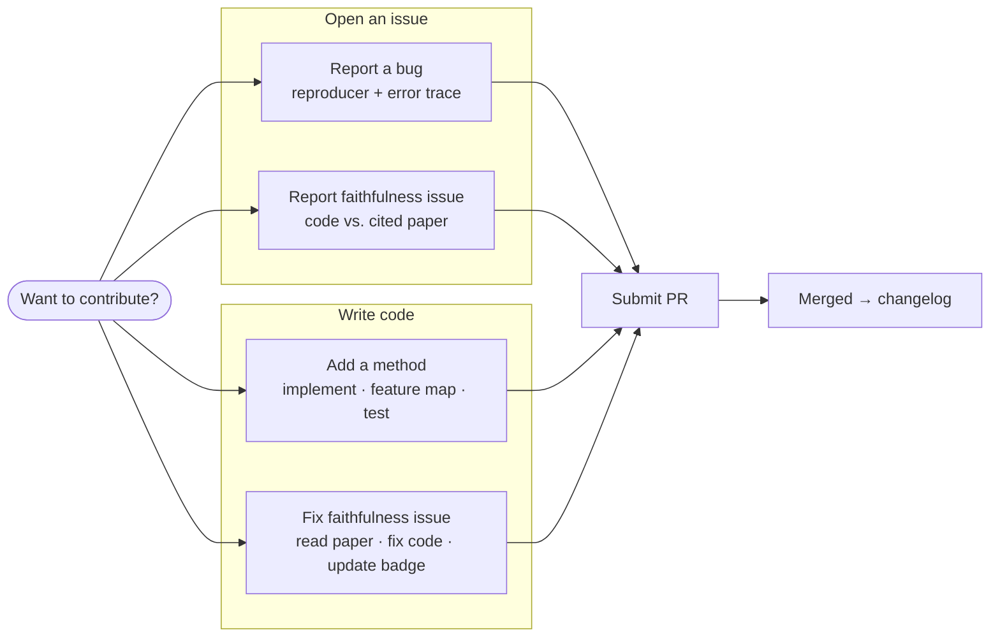

# Contributing

We welcome contributions — bug fixes, new methods, faithfulness corrections,
and docs improvements.

## Quick start

```bash
git clone https://github.com/Lexsi-Labs/SafeTune.git
cd SafeTune
pip install -e ".[dev,docs]"
```

## How to contribute



### Report a bug

Open an [issue](https://github.com/Lexsi-Labs/SafeTune/issues) with the bug
report template. Include the method name, a minimal reproducer, and the error
trace.

### Report a faithfulness issue

If a method's code doesn't match its cited paper, open a
[faithfulness report](https://github.com/Lexsi-Labs/SafeTune/issues/new?template=faithfulness_report.md).
This is the most valuable contribution you can make — it directly improves the
audit.

### Add a method

1. Implement the method faithfully against its paper under the appropriate
   pillar: `src/safetune/interventions/{harden,recover,unlearn,steer}/` or
   `src/safetune/instrumentation/{interpret,evaluate}/`.
2. Add it to the pillar's `__init__.py` `__all__` list.
3. Add an entry to the [Feature Map](../reference/feature-map.md) with the audit badge.
4. Add a row to [References](../reference/references.md) with the paper link.
5. Write a test under `tests/` that verifies the method runs on a small model.

### Fix a faithfulness issue

1. Read the cited paper carefully.
2. Fix the implementation to match.
3. Update the badge in the Feature Map (Variant→Faithful if now faithful).
4. Document the fix in the [Changelog](changelog.md).

## Development setup

- Python ≥ 3.12, PyTorch ≥ 2.7
- `pip install -e ".[dev]"` installs test deps (pytest, black, ruff, mypy)
- Install docs deps: `pip install -e ".[docs]"`
- Run tests: `pytest tests/`
- Build docs: `mkdocs build --strict`
- Preview docs: `mkdocs serve -a 0.0.0.0:8000`

## Package structure

```
src/safetune/
├── interventions/       Tier 1 — harden, recover, unlearn, steer
├── instrumentation/     Tier 2 — interpret, evaluate
├── core/                shared internals
├── data/                data loaders
├── rewards/             reward functions
├── runner/              high-level Trainer API
├── utils/               logging, auth, device management
└── __init__.py          top-level aliases
```

See [System Design](../reference/system-design.md) and
[API Contract](../reference/api-contract.md) for full documentation.

## Pull request process

1. Branch from `main`.
2. Keep commits focused — one logical change per PR.
3. Use the [PR template](https://github.com/Lexsi-Labs/SafeTune/blob/main/.github/pull_request_template.md).
4. Ensure tests pass: `pytest tests/`.
5. Ensure docs build: `pip install -e ".[docs]" && mkdocs build --strict`.
6. Request review.

## License

By contributing, you agree that your contributions are licensed under the
[Lexsi Labs Source Available License (LSAL) v1.1](https://github.com/Lexsi-Labs/SafeTune/blob/main/LICENSE.md).
