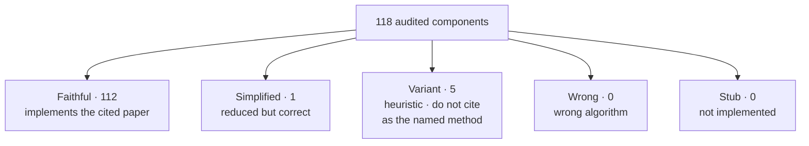

# SafeTune — Scope & Limitations

SafeTune is a library of safety methods for LLMs, organized into
a 2-tier, input-keyed taxonomy: Tier 1 interventions (Harden / Recover /
Unlearn / Steer) and Tier 2 instrumentation (Interpret / Evaluate); see the
[Taxonomy](../getting-started/taxonomy.md). It ships ~100 methods. They are
not all equal, and this page says which to trust.

## Trust levels

Every method has been faithfulness-audited against its cited paper. The verdict
distribution:

| Status | Meaning | Count |
|---|---|---|
| Faithful | implements the cited paper exactly | 112 |
| Simplified-correct | reduced but algorithmically correct | 1 |
| Variant | approximates the method; not the named algorithm | 5 |
| Wrong / buggy | wrong algorithm or broken | 0 |
| Stub / missing | not implemented | 0 |

> **Why 118, not 100?** The 118 audited components include some methods that expose
> multiple independently-audited entry points (e.g. a trainer, a sweep helper,
> and a state-dict variant counted separately). The library ships ~100 methods in
> total; the audit counts each auditable surface.

**"Runs" ≠ "correct."** Every audited component runs on a real checkpoint, but
running is not the bar — the Variant methods are internally sound yet implement a
simplified or heuristic version of their paper's algorithm, so they must not be
cited as the named method.

## How to use this toolkit responsibly

- **Check the verdict before relying on a method.** Per-method verdicts are in
  the [Feature Map](../reference/feature-map.md).
- **Only Faithful methods may be cited as the named method** from their paper.
- Simplified methods are usable but should be described as simplified.
- Variant methods run but **must not be cited** as the named method — treat them
  as experimental / unverified.

## Faithful methods

The Faithful methods, by pillar:

- **Recover:** `apply_ctheta` (C-ΔΘ), `apply_safemerge`, `apply_resta`,
  `apply_lox`, `apply_safe_lora`, `apply_safe_delta`, `apply_nlsr`,
  `apply_qresafe`, `apply_aaq`, `scrub_unlearn`, `task_arithmetic`,
  `apply_lssf`, `apply_antidote`, `apply_pke`, `apply_safereact`,
  `tracin_influence`, `apply_mscp`, `apply_wise_ft`,
  `apply_safety_vector_restore`, `apply_grad_selective_recover`,
  `apply_oneshot_safety_patch`, `apply_antidote_v2`, `apply_repnoise_recover`.
- **Unlearn:** `RMU`, `NPO`, `Gradient-Ascent / GradDiff`,
  `flat_unlearn`, `simdpo_unlearn`.
- **Harden:** `CSTTrainer`, `EMACallback`, `SafeGradTrainer`, `SPPFTTrainer`,
  `DeRTaTrainer`, `LisaTrainer`, `AsFTTrainer`, `STARDSSTrainer`, `SAPTrainer`,
  `vaccine_loss`, `booster_project`, `SaLoRA`, `DOORTrainer`, `LookAheadTrainer`,
  `tar_outer_loss`, `AntibodyTrainer`, `SurgeryTrainer`, `MARTTrainer`,
  `DeepRefusalTrainer`, `SEAMTrainer`, `CTRAPTrainer`, `RepNoiseTrainer`,
  `TVaccineTrainer`, `SEALTrainer`, `ConstrainedSFTTrainer`, `LoXHardenTrainer`.
- **Steer:** `extract_refusal_direction`, `CAA`, `LinearProbeGuardModel`,
  `ContrastiveDecodingProcessor`, `ProxyTuningProcessor`, `SafeDecodingProcessor`,
  `NudgingProcessor`, `AlphaSteerModel`, `RepBendModel`, `SafeSteerModel`,
  `SafeSwitchModel`, `SCANSModel`, `STAModel`, `CircuitBreakerModel`,
  `CircuitBreakerRRModel`, `TARModel`, `RRFAEnsemble`, `AdaSteerModel`,
  `CASTModel`.
- **Evaluate:** `AbliterationAttack`, `BoNAttack`; all eval infra —
  `StringMatchJudge`, `HFJudge`, `OpenAIJudge`, `JudgeAdapter`,
  `SpectralEntropyMonitor`, `evaluate`, `TamperBenchEvaluator`, `Pareto`
  utilities, and all dataset loaders.
- **Interpret:** `identify_safety_neurons` (weight mode), `safety_circuit_info`,
  `CircuitInfo`, `eap_safety_circuit` (EAP / EAP-IG).
- **Runtime:** the full guardrail family — `SafetyMiddleware`, `InputSanitizer`,
  `OutputVerifier`, `CoSAlignFormatter`, etc.

## Not Faithful — the 5 Variants

The 5 remaining Variant methods run correctly but must not be cited as the named
method:

- **`deeprefusal`** (Harden) — incompatible API with the published paper;
  use `DeepRefusalTrainer` instead, which is Faithful.
- **`ASRTCallback`** (Harden) — heuristic callback; the cited MART method
  requires 2 co-evolving LLMs; use `MARTTrainer` instead, which is Faithful.
- **`crisp_unlearn`** (Unlearn) — single-layer squared-L2 variant vs. the
  paper's multi-layer raw-activation approach.
- **`somf_merge`** (Recover) — magnitude-mask default vs. the paper's learned
  DPO/Concrete mask.
- **`identify_safety_neurons` activation-mode** (Interpret) — one-model
  contrast vs. cross-model set-difference metric; use weight mode for a
  Faithful result.

No remaining Wrong / Stub methods exist in the live audited surface.
