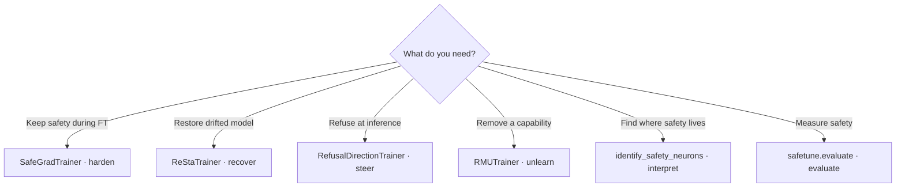

# Getting started

SafeTune is a **library of safety methods**, not a pipeline. Each
task has many independent methods that solve it by *different mechanisms* — you
**pick one** per task.

New here, in order:

1. **[Installation](installation.md)** — `pip install safetune` (Python ≥ 3.12, PyTorch), plus optional GPU extras.
2. **[Quick Start](quickstart.md)** — the same task through the Python API, the CLI, and a YAML config.
3. **[Core Concepts](taxonomy.md)** — the 2-tier, input-keyed method taxonomy.

## Just tell me what to use

Pick the path that matches your goal — each maps to one method:

Each pillar has runnable onramps in **[Examples](../examples/index.md)** (all default to
`Qwen/Qwen2.5-0.5B-Instruct`) and a full walkthrough under the **[User Guide](../user-guide/index.md)**.

## Go deeper

| | |
|---|---|
| **[Core Concepts](taxonomy.md)** | The 2-tier, input-keyed taxonomy (single source of truth) |
| **[User Guide](../user-guide/index.md)** | Per-pillar usage guides with code snippets |
| **[API Reference](../reference/api/index.md)** | Autodoc for every public trainer / function |
| **[Feature Map](../reference/feature-map.md)** | Per-method audit badges and faithfulness verdicts |

If you're unfamiliar with the site layout, see
[How to Read These Docs](how-to-read-these-docs.md) for navigation tips.

## Troubleshooting

### CUDA out of memory

Train-time defenses (`harden`) can be memory-intensive. Lower the `batch_size`
constructor argument on the harden trainer, or run on a smaller model.

### Missing optional dependencies

The core install covers every method. Some backends (vLLM judge adapters, the
faster steering / eval path) need extra packages — see
[Installation → Optional GPU extras](installation.md#optional-gpu-extras).
