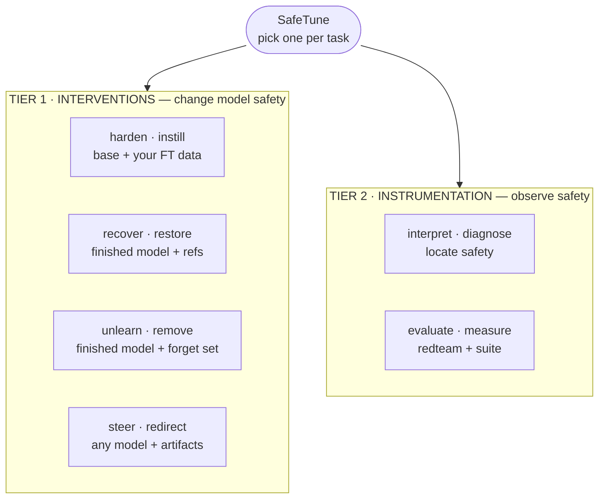

# SafeTune — Taxonomy

> **This file is the single source of truth for the SafeTune taxonomy.**
> README, this document, `reference/feature-map.md`, and the `safetune` package
> docstring all reference this document; they do not redefine it.

SafeTune is **a library of safety methods, not a pipeline.** Each
task has *many* independent methods that solve it by *different mechanisms* —
you **pick one** per task, you do not run them in sequence. The taxonomy below
exists so you can find the right shelf and then the right method on it.

**Tier 1 (Interventions)** is MECE on one axis — *what you hand the method as
input* (equivalently, *when safety is enforced*). **Tier 2 (Instrumentation)**
is not on that axis; it brackets Tier 1 — Diagnose feeds the interventions a
target, Measure scores their result.

---

## TIER 1 · Interventions

Four classes, keyed by their input. **Each class is a catalog of independent
alternatives** — each member is a *different mechanism* for the same task, not
a step in a sequence. Pick one member
(see §"Which methods to trust").

### Train-time — `safetune.harden`
**Input:** a base model **+ your fine-tuning data**. **Effect:** *harden* — the
fine-tuning itself is changed so safety survives it.
**Import:** `from safetune.runner import harden`

A Harden trainer **is** the fine-tuning — it is **not** applied to a finished
model. Members differ by mechanism family:

| Mechanism family | Catalog (alternatives) |
|---|---|
| gradient surgery | `SafeGradTrainer` |
| weight-space regularization | `AsFTTrainer`, `BoosterTrainer`, `SaLoRATrainer` |
| representation perturbation | `VaccineTrainer`, `TVaccineTrainer`, `SAPTrainer`, `SurgeryTrainer` |
| data shaping / alternation | `LisaTrainer`, `DeRTaTrainer`, `STARDSSTrainer`, `SPPFTTrainer`, `CSTTrainer` |
| data selection | `SEALTrainer` |
| distribution constraint | `ConstrainedSFTTrainer` (first-token KL penalty) |
| pre-FT subspace extrapolation | `LoXHardenTrainer` |
| tamper-resistant / representation engineering | `TARTrainer`, `RepNoiseTrainer`, `SEAMTrainer`, `CTRAPTrainer`, `DOORTrainer`, `MARTTrainer`, `DeepRefusalTrainer`, `AntibodyTrainer`, `LookAheadTrainer` |

### Weight-space (recover) — `safetune.recover`
**Input:** a **finished / drifted model** + references (an aligned and/or base
model). **Effect:** *recover* lost safety by **editing weights directly, with
NO training** (no optimizer, no forget set — pure weight arithmetic / projection).
**Import:** `from safetune.runner import recover`

Members differ by **how much of the model they touch** (the localization
spectrum: whole-model → low-rank subspace → layer → neuron → circuit):
`TaskArithmeticTrainer`, `SOMFTrainer`, `PrePostMergeTrainer`, `WiseFTTrainer`
(whole-model) · `LoXTrainer`, `LSSFTrainer`, `SafetyVectorRestoreTrainer`
(subspace) · `SafeMergeTrainer`, `SafeLoRATrainer`, `ReStaTrainer`,
`SafeDeltaTrainer`, `QReSafeTrainer`, `AAQTrainer`, `RepNoiseRecoverTrainer`
(layer) · `NLSRTrainer`, `MSCPTrainer`, `AntidoteTrainer`, `AntidoteV2Trainer`,
`PKETrainer`, `SafeReActTrainer`, `SCRUBTrainer`
(neuron) · `GradSelectiveRecoverTrainer`, `OneShotSafetyPatchTrainer`
(saliency-selected weights) · `CThetaTrainer` (circuit).

### Unlearn (remove) — `safetune.unlearn`
**Input:** a **finished model + a *forget set* (+ a retain set)**. **Effect:**
*remove* a target capability/behaviour rather than restore one. Unlike Recover,
Unlearn **trains** — it runs optimizer steps on the forget/retain data (so it is
*not* a training-free weight edit; this is why it is its own class, not a
sub-kind of Recover).
**Import:** `from safetune.runner import unlearn` (utility helpers such as `make_simdpo_pairs` import directly from `safetune.unlearn`).
Members differ by the forget objective:
`GradientAscentTrainer` / `GradDiffTrainer` (negate the LM loss on forget) · `NPOTrainer`
(reference-free preference ascent) · `RMUTrainer` (steer forget activations to a random
control vector) · `FLATTrainer` (f-divergence loss adjustment) · `SimDPOTrainer`
(reference-free DPO on chosen-refusal / rejected-harmful) · `scrub_unlearn`
(max/min KL alternation) · `crisp_unlearn` (SAE concept-feature suppression).
`tracin_influence` is a forget-influence *diagnostic*, not an editor.

### Inference-time — `safetune.steer`
**Input:** **any model + steering artifacts** (a refusal direction, contrast
vectors, an SAE atom, a logits processor). **Effect:** *steer* — wrap a frozen
model so `.generate()` stays standard; weights are untouched.
**Import:** `from safetune.runner import steer`

| Sub-kind | Catalog (alternatives) |
|---|---|
| activation steering | `RefusalDirectionTrainer`, `CAATrainer`, `AlphaSteerTrainer`, `SafeSteerTrainer`, `SafeSwitchTrainer`, `SCANSTrainer`, `STATrainer`, `AdaSteerTrainer`, `CASTTrainer`, `LinearProbeGuardTrainer` |
| conditional / adaptive gating | `CASTTrainer` (cosine-condition gate), `AdaSteerTrainer` (R-Law/H-Law adaptive strength), `SCANSTrainer` (transition-classifier sign), `LinearProbeGuardTrainer` (probe→refuse) |
| decoding steering | `ContrastiveDecodingTrainer`, `ProxyTuningTrainer`, `SafeDecodingTrainer`, `NudgingTrainer` |

> ⚠️ **Filed under steer but actually TRAIN-TIME.** `CircuitBreakerTrainer`,
> `CircuitBreakerRRTrainer`, `RepBendTrainer`, and `RRFAEnsembleTrainer` ship in
> `safetune.steer` for historical/locality reasons, but they enforce safety at
> **train time** — each fine-tunes a LoRA with a representation-rerouting /
> bend loss, and their inference hook is a **no-op pass-through by design**.
> Taxonomically they are train-time representation-engineering (a `harden`
> sibling), NOT runtime steering. Use them as trainers; don't expect a runtime
> intervention from `.generate()`. (`TARTrainer` — the train-time TAR trainer —
> already lives under `harden`.)

---

## TIER 2 · Instrumentation

Methods that **observe** safety. They produce no safer model on their own; they
serve Tier 1 — Diagnose hands an intervention a target, Measure scores it. Both
are usable standalone.

### Diagnose — `safetune.interpret`
Locate **where** safety lives and where it drifted: refusal-direction
extraction, safety-neuron localization, circuit discovery
(`identify_safety_neurons`, `safety_circuit_info`, `eap_safety_circuit`,
`CircuitInfo`). Its outputs are the *steering artifacts* Steer consumes and the
*masks* the localization-aware Recover methods consume.

### Measure — `safetune.evaluate`
Score a model's safety. Two functions kept cleanly separate:

- **`evaluate.redteam`** — stressors that degrade safety. In-house surface is
  the audited-faithful pair only: `AbliterationAttack` (a weight-space drift
  *condition*, not a prompt attack) and `BoNAttack`. Heavier red-team / tamper
  stress is sourced from maintained external harnesses (TamperBench,
  `cthetha-eval`).
- **`evaluate.suite`** — judges, benchmarks, metrics, and the
  `SpectralEntropyMonitor` drift monitor. Entry point: `evaluate.evaluate()`.

> **Naming.** The Measure pillar is named `evaluate` (it measures, it cannot verify).
> The old `verify` namespace was removed; importing `safetune.verify` raises `ModuleNotFoundError`.
> Use `evaluate` in all new code and prose.

---

## Per-class usage contracts

Each intervention class has a **different** contract — they are structurally
different, not interchangeable. This is the one place these contracts are
stated; other docs reference here.

Tier 1 Trainer classes are accessed via `from safetune.runner import harden` (or `recover`, `unlearn`, `steer`).
Tier 2 functions import directly: `from safetune.interpret import ...` · `from safetune.evaluate import ...`

| Class | Input | Call shape | Output |
|---|---|---|---|
| **Train-time** (`harden`) | base model + your FT data + aux (safety set / ref model) | `harden.XTrainer(model).train(dataset, ...)` — replaces your SFT `Trainer` | defended checkpoint |
| **Weight-space** (`recover`) | a finished model + references | `recover.XTrainer(...).apply()` — no training | patched checkpoint |
| **Weight-space** (`unlearn`) | a finished model + forget+retain sets | `unlearn.XTrainer(...).unlearn(...)` — trains | unlearned checkpoint |
| **Inference-time** (`steer`) | any model + steering artifacts | `steer.XTrainer(model).calibrate(...)` wrapper / `LogitsProcessor` | wrapped model, evaluated **live** (no checkpoint)* |
| **Diagnose** (`interpret`) | a model (± contrast data) | localization fn | directions / neuron sets / `CircuitInfo` |
| **Measure** (`evaluate`) | a model + benchmark + judge | `evaluate.evaluate(...)` | metrics |

\* Exception: an activation-steering method that can be *materialized as a
static weight edit* (e.g. refusal-direction orthogonalization,
`steer.orthogonalize_weights`) may be baked into the weights and then evaluated
as a normal checkpoint.

Because the intervention classes act at different lifecycle points, they
are evaluated by different protocols: checkpoint, paired-training, and
live-wrapper (one per intervention class).

---

## The research area (context)

Every method/benchmark in LLM-safety-after-fine-tuning is one of four
functions; the taxonomy maps onto them: **intervention** (→ Tier 1) ·
**diagnosis** (→ Interpret) · **stressors** (→ `evaluate.redteam`) ·
**evaluation** (→ `evaluate.suite`).

Stressors split into **input-space attacks** (stress a frozen model: GCG, PAIR,
AutoDAN, …) and **weight-space drift** (change the model: fine-tuning,
abliteration, backdoors). Only weight-space drift is relevant to a
drift/recovery study.

---

## Which methods to trust

The taxonomy says *what a method is for*; it says nothing about whether it
*works*. Every shipped method carries a faithfulness-audit verdict against its
cited paper.

- Trust summary and faithful-method list: [Trust & Scope](../community/scope.md).
- Per-method verdicts with evidence: [Feature Map](../reference/feature-map.md).
