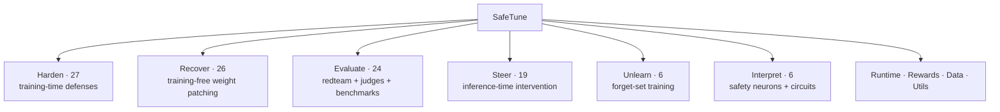

# SafeTune — References

This document lists the methods shipped in SafeTune, organized by pillar. Each row links the implementation to its originating paper and lists the non-obvious inputs required. For a runnable example and full parameter reference for any method, see its page under [User Guide](../user-guide/index.md).

## Recover

Methods that restore safety to a model that has already been fine-tuned (or otherwise degraded).

| Method | Paper | Venue / Year | arXiv | Repo | Description | Requires | Outputs |
|---|---|---|---|---|---|---|---|
| `apply_ctheta` | C-ΔΘ: Circuit-Restricted Weight Arithmetic for Selective Refusal | — | [2602.04521](https://arxiv.org/abs/2602.04521) | — | Subtracts the harmful fine-tuning delta scaled by α to recover safety-aligned weights. | aligned + base + fine-tuned model | patched weights |
| `apply_ctheta_from_state_dicts` | C-Θ (state-dict variant) | — | [2602.04521](https://arxiv.org/abs/2602.04521) | — | C-Θ weight arithmetic operating on bare state dicts for use in training loops or multi-step recovery pipelines. | aligned + base + fine-tuned model state dicts | patched state dict |
| `sweep_ctheta_strength` | C-Θ (strength sweep) | — | [2602.04521](https://arxiv.org/abs/2602.04521) | — | Sweeps α over a grid and returns patched models per strength for Pareto-front analysis. | aligned + base + fine-tuned model | list of patched models |
| `task_arithmetic` | Editing Models with Task Arithmetic (Ilharco et al.) | ICLR 2023 | [2212.04089](https://arxiv.org/abs/2212.04089) | [mlfoundations/task_vectors](https://github.com/mlfoundations/task_vectors) | Adds $\alpha \times (\theta_{\text{aligned}} - \theta_{\text{base}})$ to the fine-tuned model to restore alignment via task-vector arithmetic. | aligned + base + fine-tuned model | patched weights |
| `somf_merge` | SOMF (task-vector disentanglement) | — | [2405.09055](https://arxiv.org/abs/2405.09055) | — | Applies subspace-masked additive fusion onto the aligned model to disentangle safety from task knowledge. Faithful only when a learned mask is passed; the default magnitude-mask is a SafeTune variant. | aligned + base + fine-tuned model | patched weights |
| `learn_somf_mask` | SOMF (mask learning) | — | [2405.09055](https://arxiv.org/abs/2405.09055) | — | Learns a safety subspace mask via Concrete-relaxation + DPO mask training. Pass the learned mask to `somf_merge()` for faithful execution. | aligned + fine-tuned model + preference data | learned mask |
| `apply_safemerge` | SafeMERGE (Djuhera et al.) | ICLR 2025 Workshop | [2503.17239](https://arxiv.org/abs/2503.17239) | [aladinD/SafeMERGE](https://github.com/aladinD/SafeMERGE) | Merges unsafe fine-tuned layers toward the safety-aligned model via per-layer cosine gating on the safety-subspace projection. | aligned + base model | patched weights |
| `apply_resta` | RESTA (Bhardwaj et al.) | ACL 2024 | [2402.11746](https://arxiv.org/abs/2402.11746) | [declare-lab/resta](https://github.com/declare-lab/resta) | Adds a safety vector via task arithmetic then applies DARE drop-and-rescale to suppress harmful drift. | aligned + fine-tuned model | patched weights |
| `apply_lox` | LoX (Perin et al.) | COLM 2025 | [2506.15606](https://arxiv.org/abs/2506.15606) | — | Performs low-rank extrapolation of the safety subspace that pulls the fine-tuned model back toward the aligned base point. | aligned + fine-tuned model | patched weights |
| `apply_safe_lora` | Safe LoRA | — | [2405.16833](https://arxiv.org/abs/2405.16833) | — | Projects LoRA adapter updates into the safety-orthogonal subspace defined by alignment matrix C. | aligned model + LoRA adapter | patched weights |
| `apply_safe_delta` | Safe Delta | — | [2505.12038](https://arxiv.org/abs/2505.12038) | — | Uses OBS-style second-order delta editing to prune parameter changes that encode harmful behaviour. | aligned + fine-tuned model | patched weights |
| `apply_antidote` | Antidote (Huang et al.) | ICML 2025 | [2408.09600](https://arxiv.org/abs/2408.09600) | [git-disl/Antidote](https://github.com/git-disl/Antidote) | Prunes harmful weights identified by WANDA scores computed on harmful calibration prompts. | fine-tuned model + harmful calibration prompts | patched weights |
| `apply_mscp` | MSCP | — | [2508.09190](https://arxiv.org/abs/2508.09190) | — | Projects model weights into the safe-model weight subspace to restore safety properties. | aligned + fine-tuned model | patched weights |
| `apply_nlsr` | NLSR (Yi et al.) | — | [2412.12497](https://arxiv.org/abs/2412.12497) | — | Transplants stage-3 layers from the aligned model and gates them with a τ-threshold mask. | aligned + fine-tuned model | patched weights |
| `apply_pke` | PKE — Precision Knowledge Editing (Li et al.) | 2024 | [2410.03772](https://arxiv.org/abs/2410.03772) | [HydroXai/Enhancing-Safety-in-Large-Language-Models](https://github.com/HydroXai/Enhancing-Safety-in-Large-Language-Models) | Applies gradient-based knowledge editing targeted at neurons identified as toxic hotspots. | aligned (clean) + toxic fine-tuned model | patched weights |
| `apply_safereact` | SafeReAct | NeurIPS 2025 | — | [homles11/SafeReAct](https://github.com/homles11/SafeReAct) | Reactivates suppressed safety neurons via LoRRA representation training against the aligned model. | aligned + post-trained model; optional probe inputs | patched weights |
| `apply_qresafe` | Q-resafe (Chen et al.) | ICML 2025 | [2506.20251](https://arxiv.org/abs/2506.20251) | [Thecommonirin/Qresafe](https://github.com/Thecommonirin/Qresafe) | Identifies safety-critical neurons via SNIP scoring then retrains them with LoRA-DPO on preference data. | aligned + fine-tuned model + preference data | patched weights |
| `apply_aaq` | AAQ (Wee et al.) | — | [2511.07842](https://arxiv.org/abs/2511.07842) | — | Recovers safety lost during quantization using top-K KL APC loss on an RTN-quantized model. | aligned + fine-tuned model | patched weights |
| `apply_lssf` | LSSF | ACL 2025 | [2602.00038](https://arxiv.org/abs/2602.00038) | — | Selects a safety subspace by entropy-rank analysis then projects weights back with weighted blending. | aligned + fine-tuned model | patched weights |
| \`apply_deeprefusal\` | — (SafeTune-original heuristic) | — | — | — | Training-free counter-abliteration that projects the refusal direction back into the model's residual stream. | fine-tuned model | patched model |
| `apply_prepost_merge` | Pre + Post Merge | — | — | — | Applies weight averaging between base + aligned (pre-merge) and then with the fine-tuned model (post-merge) for two-stage recovery. | aligned + base + fine-tuned model | patched weights |
| `apply_wise_ft` | WiSE-FT (Wortsman et al.) | CVPR 2022 | [2109.01903](https://arxiv.org/abs/2109.01903) | — | Weight-space ensembling between the fine-tuned and aligned models with interpolation coefficient α. | aligned + fine-tuned model | patched weights |
| `apply_safety_vector_restore` | Safety Vector Restore | — | — | — | Computes a truncated-SVD safety subspace from aligned vs. base delta and projects the fine-tuned weights into it. | aligned + base + fine-tuned model | patched weights |
| `apply_grad_selective_recover` | Gradient-Selective Recover | — | — | — | Restores only the safety-critical dimensions identified by gradient-based attribution scores on harmful probes. | aligned + fine-tuned model + harmful probes | patched weights |
| `apply_oneshot_safety_patch` | One-Shot Safety Patch | — | — | — | Surgically patches individual parameter entries identified by their contribution to harmful output, using OBS-style pruning scores. | fine-tuned model + harmful probes | patched weights |
| `apply_antidote_v2` | Antidote v2 (Wanda-Klon) | — | — | — | Improved Antidote using normalised Wanda scores with dynamic threshold selection; prunes a larger fraction of weights than v1. | fine-tuned model + harmful calibration prompts | patched weights |
| `apply_repnoise_recover` | RepNoise (recover variant) | — | [2405.14577](https://arxiv.org/abs/2405.14577) | — | Applies gradient-based representation-noise perturbation on the drifted model, tuned for recover (not train-time defence). | drifted model + retain data | patched weights |
| `scrub_unlearn` | SCRUB (Kurmanji et al.) | NeurIPS 2023 | [2302.09880](https://arxiv.org/abs/2302.09880) | [meghdadk/SCRUB](https://github.com/meghdadk/SCRUB) | Distills toward a reference teacher on the retain set while pushing away from it on the forget set. | forget data + retain data | unlearned model |
| `tracin_influence` | TracIn (Pruthi et al.) | NeurIPS 2020 | [2002.08484](https://arxiv.org/abs/2002.08484) | [frederick0329/TracIn](https://github.com/frederick0329/TracIn) | Computes per-example influence scores as gradient dot-products summed across training checkpoints. | checkpoints + training examples | per-example influence scores |

## Unlearn

Methods that remove a specific capability from a finished model via forget/retain training.

| Method | Paper | Venue / Year | arXiv | Repo | Description | Requires | Outputs |
|---|---|---|---|---|---|---|---|
| `RMU` | RMU — Representation Misdirection for Unlearning (Li et al., WMDP) | 2024 | [2403.03218](https://arxiv.org/abs/2403.03218) | [centerforaisafety/wmdp](https://github.com/centerforaisafety/wmdp) | Steers hidden representations for harmful content onto a random anchor while preserving retain-set behaviour. | forget data + retain data | unlearned model |
| `NPO` | NPO — Negative Preference Optimization (Zhang et al.) | 2024 | [2404.05868](https://arxiv.org/abs/2404.05868) | — | Applies sigmoid-bounded negative log-likelihood on the forget set as a stable unlearning objective. | forget data | unlearned model |
| `GradientAscent` / `GradDiff` | TOFU (Maini et al.) | 2024 | [2401.06121](https://arxiv.org/abs/2401.06121) | — | Performs gradient ascent on the forget set; GradDiff adds a KL-preservation term on the retain set. | forget data (+ retain data for GradDiff) | unlearned model |
| `crisp_unlearn` | CRISP (Ashuach et al.) | 2025 | [2508.13650](https://arxiv.org/abs/2508.13650) | — | Fine-tunes the model to suppress a set of target SAE feature activations on the forget set, making the concept removal persistent and runtime-free. | frozen SAE + concept feature indices + forget/retain data | concept-suppressed model |
| `flat_unlearn` | FLAT (f-divergence unlearning) | ICLR 2025 | [2410.11143](https://arxiv.org/abs/2410.11143) | — | Reference-free unlearning that maximises an f-divergence between refusal and harmful answer distributions for each forget prompt. | forget data + retain data | unlearned model |
| `simdpo_unlearn` | SimDPO (reference-free DPO unlearning; SimPO-based) | 2024 | [2405.14734](https://arxiv.org/abs/2405.14734) | — | Treats harmful completions as rejected and safe refusals as chosen; runs DPO without a reference model. | harmful pairs + retain data | unlearned model |

## Harden

Methods that make fine-tuning itself safer, so alignment is harder to degrade in the first place.

| Method | Paper | Venue / Year | arXiv | Repo | Description | Requires | Outputs |
|---|---|---|---|---|---|---|---|
| `CSTTrainer` | CST — Configurable Safety Tuning (Gallego) | — | [2404.00495](https://arxiv.org/abs/2404.00495) | [vicgalle/configurable-safety-tuning](https://github.com/vicgalle/configurable-safety-tuning) | Wraps `trl.DPOTrainer` with the CST data formatting step so safety behaviour can be toggled by a system-prompt configuration. | preference data | hardened trainer |
| `EMACallback` | — (standard EMA) | — | — | — | Maintains an exponential moving average of model weights throughout training for a more stable checkpoint. | — | EMA checkpoint |
| `SafeGradTrainer` | SafeGrad (Yi et al.) | — | [2508.07172](https://arxiv.org/abs/2508.07172) | — | Projects gradients away from the safety-relevant parameter subspace at each optimizer step. | SFT data + safety reference | hardened trainer |
| `SPPFTTrainer` | SPPFT (Li et al.) | ICLR 2025 | [2408.17003](https://arxiv.org/abs/2408.17003) | — | Freezes the identified safety layers so those parameters are not updated during fine-tuning. | SFT data | hardened trainer |
| `DeRTaTrainer` | DeRTa — Decoupled Refusal Training (Yuan et al.) | ACL 2025 | [2407.09121](https://arxiv.org/abs/2407.09121) | — | Trains with a per-token refusing-to-answer loss appended to each SFT example. | SFT data + refusal annotations | hardened trainer |
| `ASRTCallback` | — (SafeTune-original, MART-lineage heuristic) | — | [2311.07689](https://arxiv.org/abs/2311.07689) (related) | — | Callback that adversarially perturbs inputs at each training step to expose the model to worst-case inputs. | SFT data | hardened trainer |
| `LisaTrainer` | Lisa — Lazy Safety Alignment (Huang et al.) | 2024 | [2405.18641](https://arxiv.org/abs/2405.18641) | — | Alternates a bi-state proximal optimization between task data and alignment data during fine-tuning. | task data + safety data | hardened trainer |
| `AsFTTrainer` | AsFT (Yang et al.) | NeurIPS 2025 | [2506.08473](https://arxiv.org/abs/2506.08473) | — | Anchors safety during fine-tuning by keeping updates within a narrow safety basin around the aligned model. | SFT data | hardened trainer |
| `STARDSSTrainer` | STAR-DSS (Peng et al.) | NeurIPS 2025 | [2505.17196](https://arxiv.org/abs/2505.17196) | — | Applies a dynamic safety-shaping loss during SFT to restore safety while fine-tuning. | SFT data + unsafe token list | hardened trainer |
| `SAPTrainer` | SAP — Safety-Aware Probing (Wu et al.) | — | [2505.16737](https://arxiv.org/abs/2505.16737) | — | Uses a hidden-state safety probe inside a bilevel optimization inner loop to prevent alignment degradation. | SFT data + safety probe | hardened trainer |
| `DOORTrainer` | DOOR (Zhao et al.) | ICML 2025 | [2503.03710](https://arxiv.org/abs/2503.03710) | [wicai24/DOOR-Alignment](https://github.com/wicai24/DOOR-Alignment) | Combines refusal MLE with NPO unlearning on harmful pairs; W-DOOR adds per-token proxy-reward weighting. | refusal pairs + harmful pairs (+ proxy DPO model for W-DOOR) | hardened trainer |
| `LookAheadTrainer` | LookAhead Tuning (Liu et al.) | WSDM 2026 | [2503.19041](https://arxiv.org/abs/2503.19041) | [zjunlp/LookAheadTuning](https://github.com/zjunlp/LookAheadTuning) | Inserts a partial answer preview between prompt and answer tokens to anchor safety alignment during SFT. | SFT data | hardened trainer |
| `AntibodyTrainer` | Antibody (Nguyen et al.) | — | [2603.00498](https://arxiv.org/abs/2603.00498) | — | Combines SAM-based flatness optimization with likelihood-ratio data reweighting for robustness; `xi` param implements the Theorem 4.1 coefficient. | SFT data | hardened trainer |
| `vaccine_loss` | Vaccine (Huang et al.) | NeurIPS 2024 | [2402.01109](https://arxiv.org/abs/2402.01109) | — | Applies layer-wide hidden-state perturbations during SFT to immunize the model against harmful fine-tuning. | SFT data | loss scalar |
| `SurgeryTrainer` | Surgery (Liu et al.) | — | [2602.05228](https://arxiv.org/abs/2602.05228) | — | Trains a divergence between harmful-sink and refusal-sink representations to reinforce refusal behaviour; faithful path uses a separate `harmful_dataset` batch. | refusal batch | hardened trainer |
| `booster_project` | Booster (Huang et al.) | ICLR 2025 | [2409.01586](https://arxiv.org/abs/2409.01586) | [git-disl/Booster](https://github.com/git-disl/Booster) | Estimates gradient regularization via simulated finite-difference perturbations to resist fine-tuning attacks. | SFT data | gradient projection |
| `SaLoRA` | SaLoRA (Li et al.) | ICLR 2025 | [2501.01765](https://arxiv.org/abs/2501.01765) | — | Derives a fixed safety LoRA module from the safety subspace and initializes a task-specific LoRA from it. | SFT data | LoRA adapter |
| `tar_outer_loss` | TAR (Tamirisa et al.) | ICLR 2025 | [2408.00761](https://arxiv.org/abs/2408.00761) | [rishub-tamirisa/tamper-resistance](https://github.com/rishub-tamirisa/tamper-resistance) | First-order meta-learning outer loss that explicitly trains the model to resist adversarial fine-tuning. | retain/harm/safety batches | differentiable loss scalar |
| `RepNoiseTrainer` | RepNoise (Rosati et al.) | NeurIPS 2024 | [2405.14577](https://arxiv.org/abs/2405.14577) | — | Injects representation noise during fine-tuning so a downstream recover step can easily remove the drift. | SFT data + retain data | hardened trainer |
| `SEAMTrainer` | SEAM — Self-Destructive Language Models (Wang, Yang et al.) | ICLR 2026 | [2505.12186](https://arxiv.org/abs/2505.12186) | — | Trains the model so that harmful fine-tuning collapses its usefulness, deterring tampering. | SFT data + harm annotations | hardened trainer |
| `CTRAPTrainer` | CTRAP — Collapse Trap (Yi et al.) | 2025 | [2505.16559](https://arxiv.org/abs/2505.16559) | — | Embeds a collapse trap so that harmful fine-tuning degrades the model's general capability. | SFT data + adversarial triggers | hardened trainer |
| `MARTTrainer` | MART — Multi-round Automatic Red-Teaming (Ge et al.) | — | [2311.07689](https://arxiv.org/abs/2311.07689) | — | Co-evolves an adversarial prompt generator and the target model over rounds, SFT-training the target on each round's successful attacks. | SFT data | hardened trainer |
| `DeepRefusalTrainer` | Deep Refusal | — | [2509.15202](https://arxiv.org/abs/2509.15202) | — | LoRA fine-tuning that probabilistically ablates the refusal direction so refusal is rebuilt at greater depth. | refusal pairs | hardened trainer |
| `TVaccineTrainer` / `tvaccine_loss` | T-Vaccine | — | — | — | Layer-selective SAM perturbation: perturbs only the top-k safety-critical layers identified by gradient norm. | SFT data | loss scalar |
| `SEALTrainer` | SEAL (Shen et al.) | 2024 | [2410.07471](https://arxiv.org/abs/2410.07471) | — | Selects safety-sensitive training examples via gradient-cosine scoring and up-weights them during SFT. | SFT data | hardened trainer |
| `ConstrainedSFTTrainer` | Constrained SFT (Qi et al.) | ICLR 2025 | [2406.05946](https://arxiv.org/abs/2406.05946) | — | Constrains SFT to preserve the safety-critical response prefix that standard fine-tuning erodes. | SFT data + reference model | hardened trainer |
| `apply_lox_harden` | LoX (harden variant, Perin et al.) | COLM 2025 | [2506.15606](https://arxiv.org/abs/2506.15606) | — | Pre-FT extrapolation that strengthens the aligned model's safety subspace before fine-tuning starts. | base model + aligned model | pre-conditioned model |

## Steer

Inference-time wrappers and decoding processors that steer model behaviour without modifying weights.

| Method | Paper | Venue / Year | arXiv | Repo | Description | Requires | Outputs |
|---|---|---|---|---|---|---|---|
| `extract_refusal_direction` + `RefusalDirectionModel` | Refusal Direction (Arditi et al.) | 2024 | [2406.11717](https://arxiv.org/abs/2406.11717) | — | Extracts the mean-difference refusal direction from contrast prompts and hooks it into the residual stream at inference. | contrast prompts | wrapped model |
| `CAA` / `CAAModel` | CAA — Contrastive Activation Addition (Panickssery et al.) | 2024 | [2312.06681](https://arxiv.org/abs/2312.06681) | — | Adds layer-wise steering vectors derived from contrastive prompt pairs to shift model behaviour at inference. | contrast prompts | wrapped model |
| `LinearProbeGuardModel` | Linear Probe Safety Guard | — | — | — | Trains a linear classifier on hidden states to detect harmful queries and route them to a canned refusal before generation. | labeled prompts | wrapped model |
| `ContrastiveDecodingProcessor` | Contrastive Decoding (O'Brien & Lewis) | 2023 | [2309.09117](https://arxiv.org/abs/2309.09117) | — | Subtracts amateur model logits from expert model logits at each decoding step to suppress unsafe completions. | amateur model | logits processor |
| `ProxyTuningProcessor` | Proxy Tuning (Liu et al.) | 2024 | [2401.08565](https://arxiv.org/abs/2401.08565) | — | Transfers the steering delta from a small tuned/untuned pair to a large base model at decoding time. | large base model + small base model + small tuned model | logits processor |
| `SafeDecodingProcessor` | SafeDecoding (Xu et al.) | ACL 2024 | [2402.08983](https://arxiv.org/abs/2402.08983) | — | Blends target logits with a safety-tuned guide at the shared vocabulary intersection over the first m generated tokens. | safety expert model | logits processor |
| `AlphaSteerModel` | AlphaSteer | ICLR 2026 | [2506.07022](https://arxiv.org/abs/2506.07022) | — | Applies null-space-constrained activation steering along the refusal direction with a learned α coefficient. | refusal direction vectors | wrapped model |
| `RepBendModel` | RepBend (Yousefpour et al.) | ACL 2025 | [2504.01550](https://arxiv.org/abs/2504.01550) | — | Optimizes a representation-bending loss to shape hidden states toward safe representations. | contrast data | wrapped model |
| `TARModel` | TAR (Tamirisa et al.) | ICLR 2025 | [2408.00761](https://arxiv.org/abs/2408.00761) | [rishub-tamirisa/tamper-resistance](https://github.com/rishub-tamirisa/tamper-resistance) | Training-time wrapper that routes the forward pass through `tar_outer_loss` for tamper-resistant training. | — | trained model |
| `SafeSteerModel` | SafeSteer (Ghosh et al.) | — | [2506.04250](https://arxiv.org/abs/2506.04250) | — | Prunes steering vectors via subspace projection and median-norm thresholding before applying them. | steering vectors | wrapped model |
| `SafeSwitchModel` | SafeSwitch (Han et al.) | Findings of EMNLP 2025 | [2502.01042](https://arxiv.org/abs/2502.01042) | [Hanpx20/SafeSwitch](https://github.com/Hanpx20/SafeSwitch) | Runs a two-stage safety prober that switches generation to a safe path when a threat is detected. | safety probe data | wrapped model |
| `SCANSModel` | SCANS (Cao et al.) | AAAI 2025 | [2408.11491](https://arxiv.org/abs/2408.11491) | — | Selects steering layers by vocabulary-projection analysis then applies transition-based adaptive sign steering. | contrast data | wrapped model |
| `STAModel` | STA — Steering Target Atoms (Wang et al.) | ACL 2025 | [2505.20322](https://arxiv.org/abs/2505.20322) | [zjunlp/steer-target-atoms](https://github.com/zjunlp/steer-target-atoms) | Steers safety-relevant SAE latent atoms for fine-grained control over harmful-content generation. | SAE + safety latent indices | wrapped model |
| `CircuitBreakerModel` | Circuit Breakers (Zou et al.) | NeurIPS 2024 | [2406.04313](https://arxiv.org/abs/2406.04313) | [GraySwanAI/circuit-breakers](https://github.com/GraySwanAI/circuit-breakers) | Applies LoRRA representation-rerouting training to redirect harmful representations. | harmful + benign data | wrapped model |
| `CircuitBreakerRRModel` | Circuit Breakers RR | — | [2406.04313](https://arxiv.org/abs/2406.04313) | — | RR variant of Circuit Breakers applying the LoRRA rerouting loss with a representation-redirect head. | harmful + benign data | wrapped model |
| `NudgingProcessor` | Nudging (Fei et al.) | 2024 | [2410.09300](https://arxiv.org/abs/2410.09300) | [fywalter/nudging](https://github.com/fywalter/nudging) | Nudges generation toward a safer model when the base model's top-token probability falls below a threshold. | nudge model | logits processor |
| `AdaSteerModel` | AdaSteer | EMNLP 2025 | [2504.09466](https://arxiv.org/abs/2504.09466) | [MuyuenLP/AdaSteer](https://github.com/MuyuenLP/AdaSteer) | Applies adaptive dual-direction steering (refusal + harm directions) with per-input logistic coefficients. | RD/HD steering vectors + calibration data | wrapped model |
| `RRFAEnsemble` | RRFA (Ozdincer) | COLM 2026 | — | [memo-ozdincer/RRFA](https://github.com/memo-ozdincer/RRFA) | Training-time LoRA representation-rerouting for agentic injection defense; acts as a no-op wrapper at inference. | pre-trained RRFA LoRA checkpoint | wrapped model (no-op at inference) |

## Evaluate

### Red-team attacks

| Method | Paper | Venue / Year | arXiv | Repo | Description | Requires | Outputs |
|---|---|---|---|---|---|---|---|
| `AbliterationAttack` | Abliteration (Arditi et al.) | 2024 | [2406.11717](https://arxiv.org/abs/2406.11717) | — | Removes the refusal direction from model weights to produce a maximally uncensored red-team baseline. | — | abliterated model |
| `BoNAttack` | Best-of-N Jailbreaking (Hughes et al.) | 2024 | [2412.03556](https://arxiv.org/abs/2412.03556) | — | Generates N augmented prompt variants and selects the one that elicits the most harmful completion. | judge | attack result |

### Judges & evaluation infrastructure

| Method | Paper | Venue / Year | arXiv | Repo | Description | Requires | Outputs |
|---|---|---|---|---|---|---|---|
| `StringMatchJudge` | — (canonical GCG/AdvBench prefix list) | — | — | — | Detects refusals via string-matching against a standard list of refusal prefixes. | response string | bool |
| `HFJudge` | HarmBench (Mazeika et al.) | 2024 | [2402.04249](https://arxiv.org/abs/2402.04249) | — | Scores model responses with a HuggingFace classifier (default `cais/HarmBench-Mistral-7b-val-cls`) using the official HarmBench classifier template. | model response | 0/1 label |
| `OpenAIJudge` | StrongREJECT (Souly et al.) | 2024 | [2402.10260](https://arxiv.org/abs/2402.10260) | — | Autogrades responses with a GPT-4 StrongREJECT rubric on a 1–5 harmlessness scale. | OpenAI API key + response | 1–5 score |
| `JudgeAdapter` | — (SafeTune infra) | — | — | — | Unified adapter that wraps any judge and normalizes its output to a common score format. | judge instance | normalized score |
| `SpectralEntropyMonitor` | — (SafeTune infra) | — | — | — | Monitors attention-entropy spectra across layers to detect distribution shift during inference. | model + inputs | entropy metrics |
| `evaluate` | — (SafeTune infra) | — | — | — | End-to-end evaluation pipeline that runs a model against benchmarks and aggregates judge scores. | benchmarks + judge | metric dict |
| `TamperBenchEvaluator` | TamperBench | — | [2602.06911](https://arxiv.org/abs/2602.06911) | — | Thin wrapper over the official `tamperbench` package; delegates the tamper-resistance metric to that harness. | `tamperbench` package + responses | ASR |
| Pareto utilities | — (SafeTune infra) | — | — | — | Computes the safety/utility Pareto front across a set of (safety, utility) metric pairs. | metric pairs | Pareto front |
| Dataset loaders (`advbench`, `xstest`, `sorrybench`, `orbench`, `harmbench`, `agentharm`, `saladbench`, `airbench`, `cares`, `wildjailbreak`, `jailbreakbench`, `muse`, `rwku`, `safedialbench`) | Various | Various | Various | Various | Load each named safety benchmark as a ready-to-use pandas DataFrame. | — | benchmark DataFrames |

## Interpret

Methods that localize safety-relevant structure (neurons, circuits, edges) inside a model.

| Method | Paper | Venue / Year | arXiv | Repo | Description | Requires | Outputs |
|---|---|---|---|---|---|---|---|
| `identify_safety_neurons` (weight mode) | Finding Safety Neurons (Chen et al.) | — | [2406.14144](https://arxiv.org/abs/2406.14144) | — | Localizes safety-relevant weight columns by cosine of each output-projection column against the refusal direction. | aligned reference model | neuron indices |
| `identify_safety_neurons` (activation mode) | Finding Safety Neurons (Chen et al.) | — | [2406.14144](https://arxiv.org/abs/2406.14144) | — | Localizes safety neurons by contrasting activations on harmful vs. benign prompts. SafeTune variant: a one-model harmful-vs-benign contrast vs the cited papers' cross-checkpoint metric. | contrast prompts | neuron indices |
| `safety_circuit_info` | — (SafeTune infra) | — | — | — | Convenience wrapper that runs neuron identification and packages results into a `CircuitInfo` object. | — | CircuitInfo |
| `CircuitInfo` (+ JSON/YAML I/O) | — (SafeTune infra) | — | — | — | Bidirectional round-trippable data structure for representing safety circuits; serializes to JSON and YAML. | circuit data | JSON / YAML |
| `eap_safety_circuit` | EAP-IG (Hanna et al.) | 2024 | [2403.17806](https://arxiv.org/abs/2403.17806) | [hannamw/EAP-IG](https://github.com/hannamw/EAP-IG) | Runs integrated-gradient edge attribution patching to discover the safety circuit at edge resolution. | contrast prompt pairs | CircuitInfo |

## Runtime & Rewards

These components are SafeTune infrastructure: wrappers, formatters, and reward signals with no independent paper citation.

| Component | Description |
|---|---|
| `SafetyMiddleware` | Request/response middleware layer that gates generation through a configurable safety policy. |
| `InputSanitizer` | Sanitizes raw user inputs before they reach the model (strips injections, normalizes encoding). |
| `OutputVerifier` | Post-generation verifier that checks model outputs against a policy before returning them to the caller. |
| `CoSAlignFormatter` | Formats prompts according to the CoSAlign instruction template for alignment-consistent system prompts. |
| Additional runtime guardrails | Further configurable pre/post hooks (rate limiting, logging, PII redaction, etc.). |
| `SafetyRewardFunction` / `SafetyReward` / `ToxicityReward` | Judge-based or keyword-heuristic reward signals for use in RLHF training loops; require a judge or keyword list. |
| `BiasReward` / `HarmlessnessReward` / `HallucinationReward` | Additional keyword- or judge-based reward signals for bias, harmlessness, and hallucination. |
