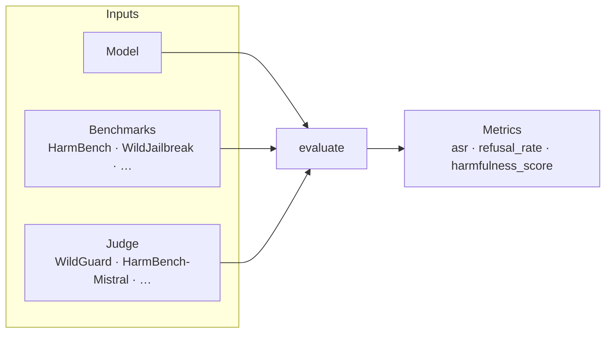

# Evaluate — measure what happened

Score a model's safety with red-team attacks and benchmark/judge evaluation.

## Input contract



## Quick example

```python
from safetune.evaluate import evaluate

results = evaluate(
    model,
    benchmarks=["harmbench", "xstest"],
    judge="wildguard",
)
print(results["harmbench"]["asr"])
```

## Catalog of alternatives

| Sub-kind | Methods | Guide |
|---|---|---|
| red-team attacks | [AbliterationAttack](evaluate/attacks/abliteration.md), [BoNAttack](evaluate/attacks/bon.md) | [Attacks overview](evaluate/attacks/index.md) |
| benchmarks | `BenchmarkSpec`, `REGISTRY`, `list_benchmarks()` | [Benchmarks](evaluate/benchmarks/index.md) |
| judges | `run_judge()`, `JudgeAdapter`, `JUDGE_REGISTRY` | [Judges](evaluate/judges/index.md) |
| evaluation pipeline | `evaluate()`, `evaluate_with_vllm_backend()`, `run_safety_eval()` | [Pipeline](evaluate/pipeline/index.md) |
| spectral monitoring | `SpectralEntropyMonitor` | [Monitoring](evaluate/monitoring/index.md) |
| TamperBench harness | `TamperBenchEvaluator` | [TamperBench](evaluate/tamperbench/index.md) |
| Pareto frontier | `ParetoVisualizer`, `ParetoPoint` | [Pareto frontier](evaluate/pareto/index.md) |

## Naming

`evaluate` is the name (it *measures*, it cannot *verify*).
