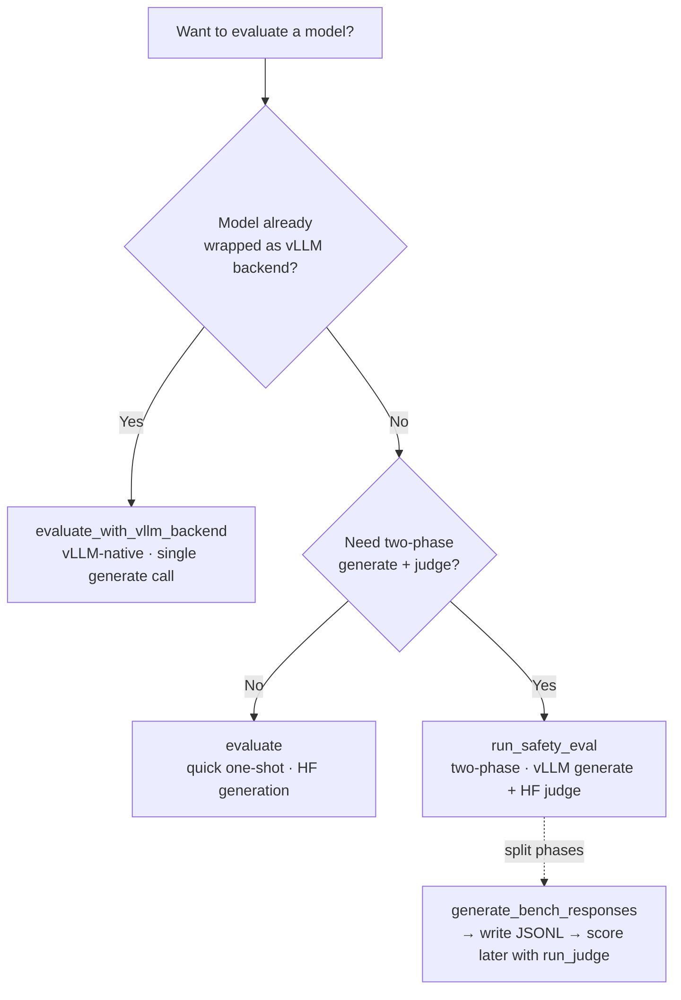

# Evaluation pipeline

Three entry points for running safety benchmarks, from simplest to most flexible.



## evaluate()

```python
from safetune.evaluate import evaluate

results = evaluate(
    model,
    benchmarks=None,         # defaults to paper safety suite
    judge="wildguard",
    tokenizer=None,
    batch_size=8,
    max_new_tokens=512,
)
```

`evaluate()` returns a `dict` keyed by **benchmark name** — one entry per
benchmark you ran, e.g. `results["harmbench"]`. Each entry is itself a dict
with these keys:

| Key | Type | Description |
|---|---|---|
| `asr` | `float` | Attack success rate |
| `refusal_rate` | `float` | `1 - asr` |
| `harmfulness_score` | `float` | Mean harmfulness `[0, 1]` |
| `n` | `int` | Total prompts |
| `headline_metric` | `str` | `"refusal_rate"` or `"asr"` |

So read a metric as `results["harmbench"]["asr"]`, not `results["asr"]`.

## evaluate_with_vllm_backend()

```python
from safetune.evaluate.suite.evaluate import evaluate_with_vllm_backend

results = evaluate_with_vllm_backend(
    backend,              # pre-built vLLM backend
    benchmarks=None,
    judge="wildguard",
)
```

Drop-in replacement for `evaluate()` when the model is already wrapped as a
vLLM backend (e.g. `VLLMHookSteer`, `VLLMDecodeSteer`). All prompts generated
in a single vLLM call, then judged in HF batches.

## run_safety_eval()

```python
from safetune.evaluate.pipeline import run_safety_eval

results = run_safety_eval(
    model_path="meta-llama/Llama-3.2-1B-Instruct",
    benchmarks=["harmbench", "wildjailbreak"],
    backend="vllm",
)
```

Two-phase: (1) load target model once via vLLM, generate all responses,
(2) load each judge model separately, score, and unload.

### Generate first, judge later

```python
from safetune.evaluate.pipeline import generate_bench_responses, write_bench_jsonl

bench_data = generate_bench_responses(
    model_path, benchmarks=["harmbench"], backend="vllm",
)
write_bench_jsonl(bench_data, "./results", "my-model")
```

## When to use

- `evaluate()` — quick one-shot HF evaluation.
- `evaluate_with_vllm_backend()` — when the model is already a vLLM backend.
- `run_safety_eval()` — two-phase with separate generate/score steps.
