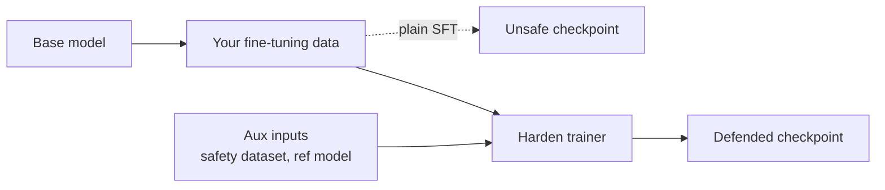

# Harden — train-time defense

Keep safety during fine-tuning. A Harden trainer replaces your `transformers.Trainer`:
it runs the fine-tuning itself rather than patching a model after training.

## Input contract

A base model plus your fine-tuning data, plus per-method aux inputs (a safety
dataset, a reference model). Output: a defended checkpoint.

## Quick example

```python
from safetune.runner import harden

trainer = harden.SafeGradTrainer(model, tokenizer)
trainer.train(train_dataset, safety_dataset=safety_dataset)
```

> **Data format:** `train_dataset` and `safety_dataset` are HuggingFace `Dataset`s
> (or iterables of dicts) with `input_ids`, `attention_mask`, and `labels`
> columns. For a quick start, `harden.load_harden_data(model_id)` returns a
> ready `(train_dataset, safety_dataset)` pair built from BeaverTails.

## Lifecycle

A Harden trainer replaces your SFT loop:



## Catalog of alternatives

Each is a different mechanism; pick one. Follow a family link for full
signatures, parameter tables, runnable examples, and citations per method.

| Mechanism family | Methods | Guide |
|---|---|---|
| gradient surgery | `PlainSFTTrainer` (baseline), `SafeGradTrainer` | [Gradient surgery](harden/gradient-surgery.md) |
| weight-space regularization | `AsFTTrainer`, `BoosterTrainer`, `SaLoRATrainer` | [Regularization](harden/regularization.md) |
| representation perturbation | `VaccineTrainer`, `TVaccineTrainer`, `SAPTrainer`, `SurgeryTrainer` | [Representation](harden/representation.md) |
| data shaping / alternation | `LisaTrainer`, `DeRTaTrainer`, `STARDSSTrainer`, `SPPFTTrainer`, `CSTTrainer` | [Data shaping](harden/data-shaping.md) |
| data selection | `SEALTrainer` | [Data selection](harden/data-selection.md) |
| distribution constraint | `ConstrainedSFTTrainer` (first-token KL penalty) | [Constrained SFT](harden/constrained-sft.md) |
| pre-FT subspace extrapolation | `LoXHardenTrainer` | [Pre-FT extrapolation](harden/pre-ft.md) |
| tamper-resistant / representation engineering | `TARTrainer`, `RepNoiseTrainer`, `SEAMTrainer`, `CTRAPTrainer`, `DOORTrainer`, `MARTTrainer`, `DeepRefusalTrainer`, `AntibodyTrainer`, `LookAheadTrainer` | [Tamper-resistant & rep-engineering](harden/tamper-resistant.md) |

## Evaluate after hardening

```python
from safetune.evaluate import evaluate

results = evaluate(model, benchmarks=["xstest"], judge="wildguard")
print(results["xstest"])
```
