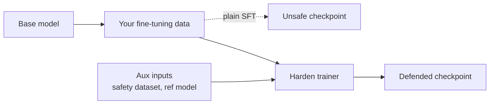

# Harden — train-time defense

Keep safety during fine-tuning. A Harden trainer replaces your `transformers.Trainer`:
it runs the fine-tuning itself rather than patching a model after training.

## Input contract

A base model plus your fine-tuning data, plus per-method aux inputs (a safety
dataset, a reference model). Output: a defended checkpoint.

## Quick example

```python
from safetune.runner import harden

trainer = harden.SafeGradTrainer(model, tokenizer)
trainer.train(train_dataset, safety_dataset=safety_dataset)
```

> **Data format:** `train_dataset` and `safety_dataset` are HuggingFace `Dataset`s
> (or iterables of dicts) with `input_ids`, `attention_mask`, and `labels`
> columns, or raw rows that SafeTune tokenises with the chat template: chat
> `messages`, ShareGPT `conversations`, Alpaca `instruction`/`input`/`output`, or
> prompt/response (DPO `prompt`/`chosen`) columns. Rows without a response are
> skipped with a warning, and prompt-only data raises. For a quick start,
> `harden.load_harden_data(model_id)` returns a ready `(train_dataset,
> safety_dataset)` pair built from BeaverTails.
>
> **Sequence length:** raw rows are tokenized with `max_len=None` by default:
> the length is sized from the chat template as `max(256, longest templated
> prompt among the first rows + 256)`, capped at 2048, so a long system
> preamble (Tiny Aya's template adds about 366 tokens) does not fill the
> sequence. An explicit `max_len` is used exactly; if it leaves no row with a
> supervised token the loader raises (naming the templated prompt length), and
> it warns with a count when only some rows are fully masked.

A source string works too: a `safetune.data.dataset_ids` name, an HF id, a local
file, or a dataset folder such as a CuratorKIT export with its config name:

```python
trainer.train("./curated_out", dataset_config="sft_sharegpt")
```

The checkpoint folder gets a `lexsi_provenance.json` that records the model and
dataset it came from (and the CuratorKIT export's own provenance), and
`safetune.push_to_hub(path, "org/name")` uploads it.

`train()` wraps the model in a LoRA adapter, runs the method, merges the adapter
and returns the path of the saved checkpoint.

## One class per method

`safetune.harden.SafeGradTrainer` and `safetune.runner.harden.SafeGradTrainer`
are the same class; the same holds for every trainer in the catalog below.

Most of these trainers run a `transformers.Trainer` subclass. It is exported as
`<Name>HFTrainer` (`SafeGradHFTrainer`, `LisaHFTrainer`, ...; DOOR's is the
`trl.DPOTrainer` subclass `SafetyDOORTrainer`), with its `<Name>Config`. Use it
when you want your own training loop: your own `TrainingArguments` and data
collators, no LoRA wrapping, and a `TrainOutput` back instead of a checkpoint.

```python
from safetune.harden import SafeGradHFTrainer, SafeGradConfig

trainer = SafeGradHFTrainer(model=model, args=SafeGradConfig(output_dir="out"),
                            train_dataset=train_dataset, safety_dataset=safety_loader,
                            reference_model=reference_model)
trainer.train()
```

Up to 0.1.3, `safetune.harden.SafeGradTrainer` was that `transformers.Trainer`
subclass. The old call, `SafeGradTrainer(model=..., args=..., train_dataset=...)`,
still works until 0.3: it returns a `SafeGradHFTrainer` and emits a
`DeprecationWarning`. So does importing the old name from a submodule
(`from safetune.harden.safegrad import SafeGradTrainer`).

## Lifecycle

A Harden trainer replaces your SFT loop:


```mermaid
flowchart LR
    BASE[Base model] --> TASK[Your fine-tuning data]
    TASK -.->|plain SFT| UNSAFE[Unsafe checkpoint]
    TASK --> HARDEN[Harden trainer]
    AUX[Aux inputs<br/>safety dataset, ref model] --> HARDEN
    HARDEN --> SAFE[Defended checkpoint]
```

## Catalog of alternatives

Each is a different mechanism; pick one. Follow a family link for full
signatures, parameter tables, runnable examples, and citations per method.

| Mechanism family | Methods | Guide |
|---|---|---|
| gradient surgery | `PlainSFTTrainer` (baseline), `SafeGradTrainer` | [Gradient surgery](harden/gradient-surgery.md) |
| weight-space regularization | `AsFTTrainer`, `BoosterTrainer`, `SaLoRATrainer` | [Regularization](harden/regularization.md) |
| representation perturbation | `VaccineTrainer`, `TVaccineTrainer`, `SAPTrainer`, `SurgeryTrainer` | [Representation](harden/representation.md) |
| data shaping / alternation | `LisaTrainer`, `DeRTaTrainer`, `STARDSSTrainer`, `SPPFTTrainer`, `CSTTrainer` | [Data shaping](harden/data-shaping.md) |
| data selection | `SEALTrainer` | [Data selection](harden/data-selection.md) |
| distribution constraint | `ConstrainedSFTTrainer` (first-token KL penalty) | [Constrained SFT](harden/constrained-sft.md) |
| pre-FT subspace extrapolation | `LoXHardenTrainer` | [Pre-FT extrapolation](harden/pre-ft.md) |
| tamper-resistant / representation engineering | `TARTrainer`, `RepNoiseTrainer`, `SEAMTrainer`, `CTRAPTrainer`, `DOORTrainer`, `MARTTrainer`, `DeepRefusalTrainer`, `AntibodyTrainer`, `LookAheadTrainer` | [Tamper-resistant & rep-engineering](harden/tamper-resistant.md) |

## Evaluate after hardening

```python
from safetune.evaluate import evaluate

results = evaluate(model, benchmarks=["xstest"], judge="wildguard")
print(results["xstest"])
```
