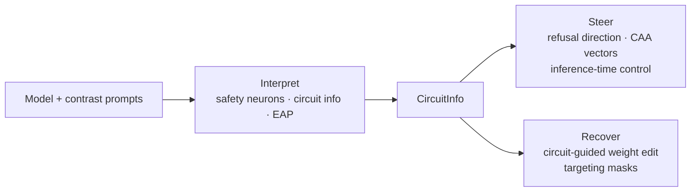

# Interpret — diagnose where safety lives

Locate safety-relevant structure (directions, neurons, circuits) inside a model.
Interpret changes nothing on its own; its artifacts are *inputs* to Steer and
localization-aware Recover methods.

## Input contract



## Quick example

```python
from safetune.interpret import safety_circuit_info

circuit = safety_circuit_info(
    model, tokenizer,
    harmful_prompts=harmful, harmless_prompts=harmless,
)
```

## Catalog of alternatives

| Method | What it finds | Guide |
|---|---|---|
| `identify_safety_neurons` (weight mode) | safety-relevant weight columns | [Weight-based](interpret/safety-neurons/weight.md) |
| `identify_safety_neurons` (activation mode) | safety neurons by activation contrast | [Activation-based](interpret/safety-neurons/activation.md) |
| `safety_circuit_info` | convenience wrapper — both steps in one call | [safety_circuit_info](interpret/circuit-info/safety-circuit-info.md) |
| `CircuitInfo` | round-trippable data container | [CircuitInfo object](interpret/circuit-info/circuit-info-object.md) |
| `eap_safety_circuit` | edge attribution patching | [EAP / EAP-IG](interpret/eap/index.md) |
