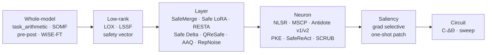

# Recover — weight-space restoration

Restore safety in a drifted model. Weight-space editing — **no training**.

## Input contract

A **finished / drifted model**, plus `base` and `aligned` references.

## Quick example

```python
from safetune.runner import recover

trainer = recover.ReStaTrainer(
    drifted_model, base_model=base_model, aligned_model=aligned_model
)
patched = trainer.apply()
```

## Catalog of alternatives

Methods differ by how much of the model they touch, a spectrum from
coarsest (whole-model) to finest (single circuit location):



Coarser edits (left) move more weights at once; finer edits (right) target
specific neurons or circuits.

| Granularity | Methods | Guide |
|---|---|---|
| whole-model | [task_arithmetic](recover/whole-model/task-arithmetic.md), [SOMF merge](recover/whole-model/somf-merge.md), [pre-post merge](recover/whole-model/pre-post-merge.md), [WiSE-FT](recover/whole-model/wise-ft.md) | [Whole-model overview](recover/whole-model/index.md) |
| low-rank | [LOX](recover/low-rank/lox.md), [LSSF](recover/low-rank/lssf.md), [safety vector restore](recover/low-rank/safety-vector-restore.md) | [Low-rank overview](recover/low-rank/index.md) |
| layer | [SafeMerge](recover/layer/safe-merge.md), [Safe LoRA](recover/layer/safe-lora.md), [RESTA](recover/layer/resta.md), [Safe Delta](recover/layer/safe-delta.md), [QReSafe](recover/layer/qresafe.md), [AAQ](recover/layer/aaq.md), [RepNoise](recover/layer/repnoise-recover.md) | [Layer overview](recover/layer/index.md) |
| neuron | [NLSR](recover/neuron/nlsr.md), [MSCP](recover/neuron/mscp.md), [Antidote v1](recover/neuron/antidote-v1.md), [Antidote v2](recover/neuron/antidote-v2.md), [PKE](recover/neuron/pke.md), [SafeReAct](recover/neuron/safereact.md), [SCRUB (recover)](recover/neuron/scrub-recover.md) | [Neuron overview](recover/neuron/index.md) |
| saliency | [grad selective](recover/saliency/grad-selective.md), [one-shot patch](recover/saliency/one-shot-patch.md) | [Saliency overview](recover/saliency/index.md) |
| circuit | [C-ΔΘ](recover/circuit/c-delta-theta.md), [C-ΔΘ state-dict](recover/circuit/c-delta-theta-state.md), [sweep C-ΔΘ](recover/circuit/sweep-c-delta-theta.md) | [Circuit overview](recover/circuit/index.md) |
