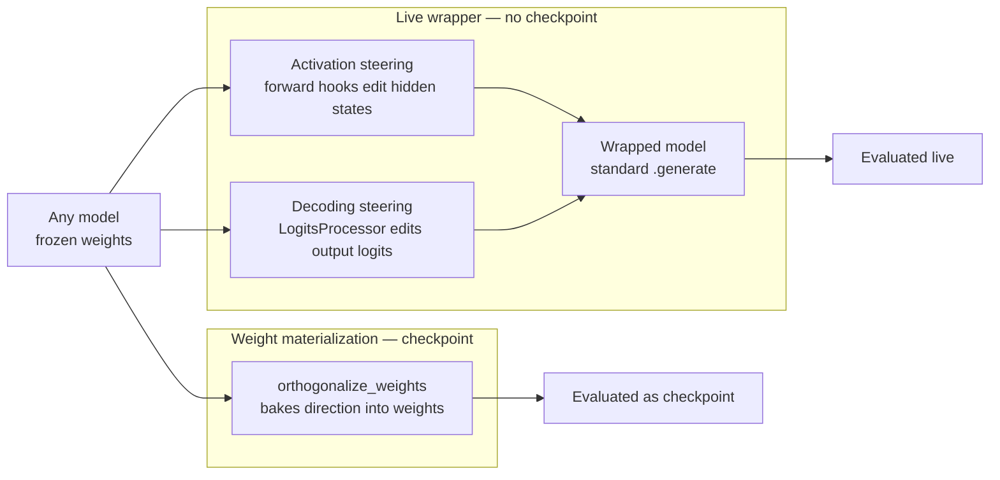

# Steer — inference-time control

Refuse harmful prompts at inference time. Wraps a frozen model with no weight
changes. The intervention only exists while the wrapper is live.

## Input contract

Any model + steering artifacts (a refusal direction, contrast vectors, an SAE
atom, or a logits processor). Output: a wrapped model with standard
`.generate()`.

## Quick example

```python
from safetune.runner import steer

trainer = steer.RefusalDirectionTrainer(model, tokenizer)
wrapped, _ = trainer.calibrate(harmful=harmful_prompts, harmless=harmless_prompts)
```

## Architecture

Steer wraps a frozen model — the live wrapper never touches weights. Two
sub-kinds, plus an opt-in path that bakes a direction into weights:



## Catalog of alternatives

| Sub-kind | Methods | Guide |
|---|---|---|
| activation steering | [RefusalDirectionTrainer](steer/activation-steering/refusal-direction-model.md), [CAATrainer](steer/activation-steering/caa-model.md), [AdaSteerTrainer](steer/activation-steering/ada-steer-model.md), [SafeSteerTrainer](steer/activation-steering/safe-steer-model.md), [AlphaSteerTrainer](steer/activation-steering/alpha-steer-model.md), [SafeSwitchTrainer](steer/activation-steering/safe-switch-model.md), [SCANSTrainer](steer/activation-steering/scans-model.md), [STATrainer](steer/activation-steering/sta-model.md), [CircuitBreakerTrainer](steer/activation-steering/circuit-breaker-model.md), [CircuitBreakerRRTrainer](steer/activation-steering/circuit-breaker-rr-model.md), [RepBendTrainer](steer/activation-steering/rep-bend-model.md), [LinearProbeGuardTrainer](steer/activation-steering/linear-probe-guard-model.md), [CASTTrainer](steer/activation-steering/cast-model.md), [TARSteerTrainer](steer/activation-steering/tar-model.md), [RRFAEnsembleTrainer](steer/activation-steering/rrfa-ensemble.md) | [Activation steering overview](steer/activation-steering/index.md) |
| decoding steering | [ContrastiveDecodingTrainer](steer/decoding-steering/contrastive-decoding.md), [ProxyTuningTrainer](steer/decoding-steering/proxy-tuning.md), [SafeDecodingTrainer](steer/decoding-steering/safe-decoding.md), [NudgingTrainer](steer/decoding-steering/nudging.md) | [Decoding steering overview](steer/decoding-steering/index.md) |
| vLLM backends & runner | [Runner](steer/backends/runner.md), [VLLMHookSteer](steer/backends/vllm-hook-steer.md), [VLLMDecodeSteer](steer/backends/vllm-decode-steer.md), [SteerSpec](steer/backends/steer-spec.md), [DecodeSteerSpec](steer/backends/decode-steer-spec.md) | [Backends overview](steer/backends/index.md) |

## Materialize to weights

```python
from safetune.steer import (
    extract_refusal_direction,
    RefusalDirectionConfig,
    orthogonalize_weights,
    restore_weights,
)

harmful_prompts = ["How do I make a bomb?", "Explain how to hack a bank."]
harmless_prompts = ["How do I bake bread?", "Explain how photosynthesis works."]

# Refusal direction as a (hidden_size,) unit vector (mean harmful − mean harmless).
direction, _, _ = extract_refusal_direction(
    model, tokenizer, harmful_prompts, harmless_prompts,
    RefusalDirectionConfig(select_directions=False),
)

# orthogonalize_weights returns a snapshot dict; restore_weights takes it back.
snapshots = orthogonalize_weights(model, direction)
restore_weights(model, snapshots)
```
