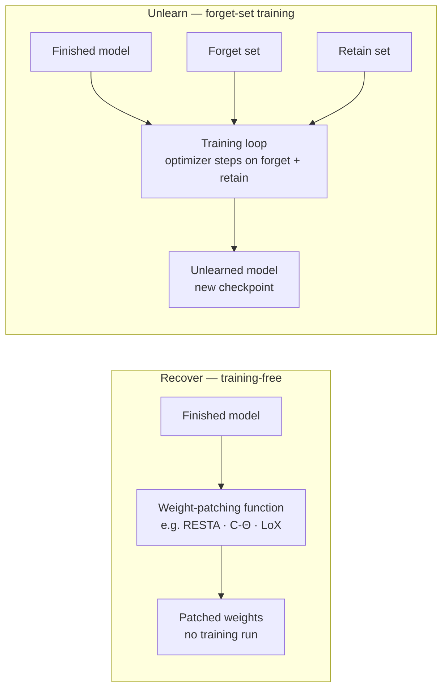

# Unlearn — remove a capability

Remove a capability from a finished model using optimizer steps on forget/retain data.



## Input contract

A finished model + a **forget set** + a **retain set**. The forget set defines
what to remove; the retain set preserves everything else. Unlike Recover,
Unlearn trains: it runs optimizer steps.

## Quick example

```python
from safetune.runner import unlearn

trainer = unlearn.RMUTrainer(model)
trainer.unlearn(forget=forget_batches, retain=retain_batches)
```

> **Data format:** `forget` and `retain` are iterables of tokenized batches —
> dicts with `input_ids`, `attention_mask`, and `labels`. For a quick start,
> `unlearn.load_unlearn_data(model_id)` returns a `(forget, retain)` pair. FLAT
> and SimDPO train on refusal/harmful preference pairs; pass raw `forget` batches
> and they build the pairs for you (see their pages).

## Catalog of alternatives

| Method | Mechanism | Guide |
|---|---|---|
| `RMU` | representation misdirection — steers harmful hidden states to random anchors | [RMU](unlearn/rmu.md) |
| `NPO` | negative preference optimization — sigmoid-bounded NLL on forget set | [NPO](unlearn/npo.md) |
| `GradientAscent` / `GradDiff` | gradient ascent on forget set (+ KL preservation on retain) | [Gradient Ascent](unlearn/gradient-ascent.md) |
| `FLATTrainer` | f-divergence variational bound, no reference model needed | [FLAT](unlearn/flat.md) |
| `SimDPOTrainer` | SimDPO-style unlearning, reference-free | [SimDPO](unlearn/simdpo.md) |
