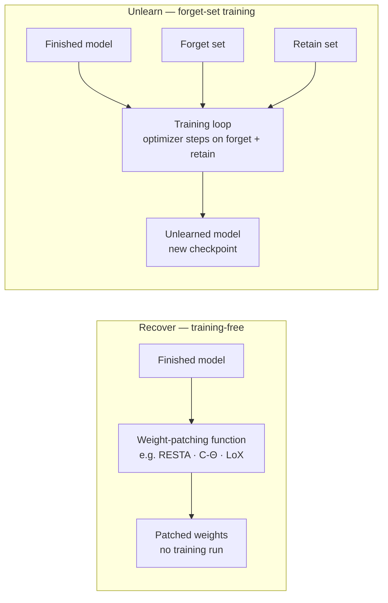

# Unlearn — remove a capability

Remove a capability from a finished model using optimizer steps on forget/retain data.


```mermaid
flowchart LR
    subgraph RECOVER[Recover — training-free]
        A1[Finished model] --> B1[Weight-patching function<br/>e.g. RESTA · C-Θ · LoX]
        B1 --> C1[Patched weights<br/>no training run]
    end
    subgraph UNLEARN[Unlearn — forget-set training]
        A2[Finished model] --> B2[Training loop<br/>optimizer steps on forget + retain]
        A3[Forget set] --> B2
        A4[Retain set] --> B2
        B2 --> C2[Unlearned model<br/>new checkpoint]
    end
```

## Input contract

A finished model + a **forget set** + a **retain set**. The forget set defines
what to remove; the retain set preserves everything else. Unlike Recover,
Unlearn trains: it runs optimizer steps.

## Quick example

```python
from safetune.runner import unlearn

trainer = unlearn.RMUTrainer(model)
trainer.unlearn(forget=forget_batches, retain=retain_batches)
```

> **Data format:** `forget` and `retain` are iterables of tokenized batches —
> dicts with `input_ids`, `attention_mask`, and `labels`. For a quick start,
> `unlearn.load_unlearn_data(model_id)` returns a `(forget, retain)` pair. FLAT
> and SimDPO train on refusal/harmful preference pairs; pass raw `forget` batches
> and they build the pairs for you (see their pages).
>
> **Sequence length:** `load_unlearn_data` tokenizes with `max_len=None` by default:
> the length is sized from the chat template as `max(256, longest templated
> prompt among the first rows + 256)`, capped at 2048, so a long system
> preamble (Tiny Aya's template adds about 366 tokens) does not fill the
> sequence. An explicit `max_len` is used exactly; if it leaves no row with a
> supervised token the loader raises (naming the templated prompt length), and
> it warns with a count when only some rows are fully masked.

## Precision

Every unlearn trainer takes `upcast: bool = True`: a model loaded in fp16 or
bf16 is cast to fp32 before `unlearn()` runs (with a warning). fp16 overflows,
and bf16 has 8 mantissa bits, so at `lr=1e-5` most updates round away (about 80%
lost on Tiny Aya) and unlearning silently does little. `upcast=False` keeps the
low-precision weights, e.g. to save memory. `upcast_fp16` is a deprecated alias
of `upcast`. Results therefore depend on the dtype you train in.

## Catalog of alternatives

| Method | Mechanism | Guide |
|---|---|---|
| `RMU` | representation misdirection — steers harmful hidden states to random anchors | [RMU](unlearn/rmu.md) |
| `NPO` | negative preference optimization — sigmoid-bounded NLL on forget set | [NPO](unlearn/npo.md) |
| `GradientAscent` / `GradDiff` | gradient ascent on forget set (+ KL preservation on retain) | [Gradient Ascent](unlearn/gradient-ascent.md) |
| `FLATTrainer` | f-divergence variational bound, no reference model needed | [FLAT](unlearn/flat.md) |
| `SimDPOTrainer` | SimDPO-style unlearning, reference-free | [SimDPO](unlearn/simdpo.md) |
